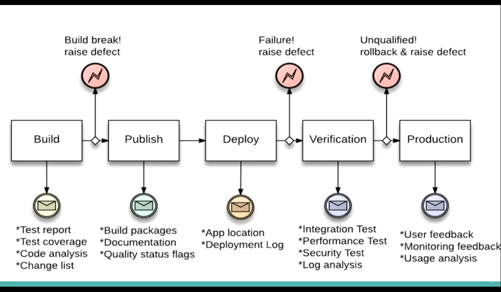

Integration means we  are getting all the work from different members of the dev teams into the software. When trying to get all parts at the final phase of the project, we could potentially get into trouble as different parts will not behave as it should.
  
Instead of trying integration phase at the end of the project, we could try to spread it on the whole length of the development.

Software is always in a working state and ready to run. If a change breaks the product we can fix it immediately.

I. Build phase
- headless build = our project can run independently without a tool  
- automated on SCM commit = ideally, when a dev commits something it should build automatically
- dependency management
- run unit and integration tests
II. Publish phase
- builds are packaged into artifacts (could be executables, archives) and published on the build server
III. Deploy phase
- pull artifacts and deploy to test server (real working server)
IV. Verification phase
- run automation tests against test server
- run performance tests
- produce reports (qualitative)

## CI Pipeline

