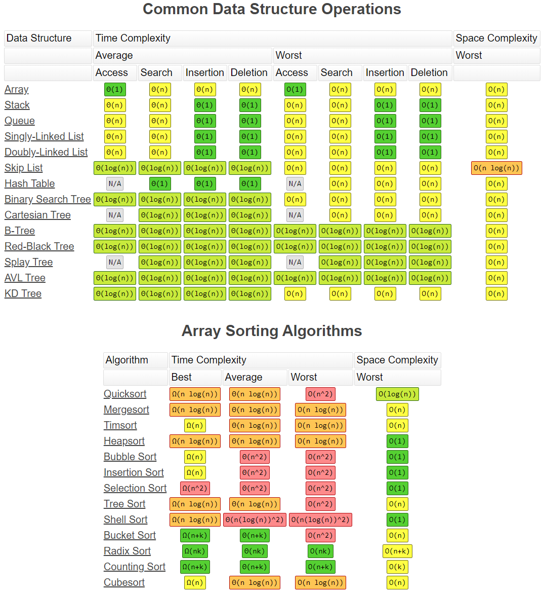
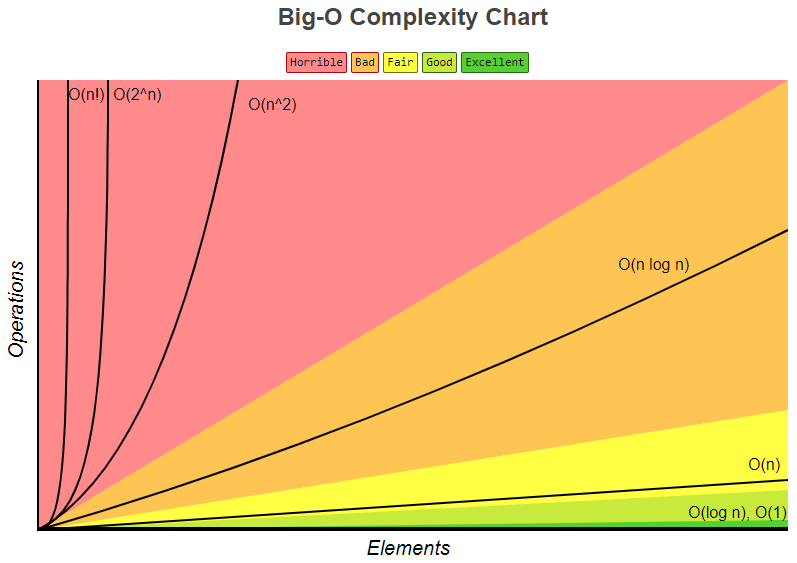
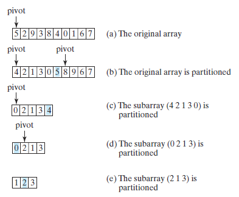
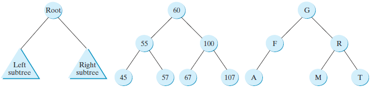

## Difference between Stack and Queue

A **stack** is a linear data structure in which elements can be inserted and deleted only from one side of the list, called the top. A stack follows the LIFO (*Last In First Out*) principle, i.e., the element inserted at the last is the first element to come out. The insertion of an element into stack is called **push** operation, and deletion of an element from the stack is called **pop** operation. In stack we always keep track of the last element present in the list with a pointer called **top**.
  
 A **queue** is a linear data structure in which elements can be inserted only from one side of the list called rear, and the elements can be deleted only from the other side called the front. The queue data structure follows the FIFO (*First In First Out*) principle, i.e. the element inserted at first in the list, is the first element to be removed from the list. The insertion of an element in a queue is called an **enqueue** operation and the deletion of an element is called a **dequeue** operation. 
   
## Describe Heap

A Heap is a special Tree-based data structure in which the tree is a complete binary tree (priority). Generally heaps can be Max-heap (key present at the root node must be greatest among the keys present at all of it’s children. The same property must be recursively true for all sub-trees in that Binary Tree) or Min-heap

## Complexity of algorithms, big O notation

In computer science, big O notation is used to classify algorithms according to how their run time or space requirements grow as the input size grows.





## Trees, graphs and ways to traverse graph

- arrays and linked lists = linear data structures.  
- graphs and trees = non-linear data structures  

- A graph is a system in which there are potentially multiple ways to get from an arbitrary point, A, to another arbitrary point, B
- A graph is normally defined as a pair of sets (V,E). V is a set of arbitrary objects called vertices or nodes, and E is a set of pairs of vertices, which we call edges or (more rarely) arcs
- To visit each node or vertex which is a connected component, tree-based algorithms are used. You can do this easily by iterating through all the vertices of the graph, performing the algorithm on each vertex that is still unvisited when examined
- **Depth-first Search** (DFS) is an algorithm for searching a graph or tree data structure. The algorithm starts at the root (top) node of a tree and goes as far as it can down a given branch (path), and then backtracks until it finds an unexplored path, and then explores it. The algorithm does this until the entire graph has been explored. Many problems in computer science can be thought of in terms of graphs. 
- DFS Algorithm applications
  - analyzing networks, mapping routes
  - scheduling, and finding spanning trees
  
```plaintext
dfs(vertex v)
    visit(v);
    for each neighbor w of v
        if w is unvisited
            dfs(w);
            add edge vw to tree T
```
- **Breadth-first Search** (BFS) starts at the tree root (or some arbitrary node of a graph, sometimes referred to as a ‘search key’), and explores all of the neighbor nodes at the present depth prior to moving on to the nodes at the next depth level.
```plaintext
create a queue Q 
mark v as visited and put v into Q 
while Q is non-empty 
    remove the head u of Q 
    mark and enqueue all (unvisited) neighbours of u
```
- BFS Algorithm Applications
    - To build index by search index
    - For GPS navigation
    - Path finding algorithms 
    - In Ford-Fulkerson algorithm to find maximum flow in a network 
    - Cycle detection in an undirected graph
    - In minimum spanning tree

## Sorting algorithms

**Insertion sort**

The insertion-sort algorithm sorts a list of values by repeatedly inserting a new element into a sorted sublist until the whole list is sorted.

```java
public class InsertionSort {

    public static void insertionSort(int[] list) {
        for (int i = 1; i < list.length; i++) {
/** Insert list[i] into a sorted sublist list[0..i−1] so that list[0..i] is sorted. */
            int currentElement = list[i];
            int k;
            for (k = i − 1; k >= 0 && list[k] > currentElement; k−−) {
            list[k + 1] = list[k];
            }

// Insert the current element into list[k + 1]
            list[k + 1] = currentElement;
        }
    }
}
```
**Bubble sort**

A bubble sort sorts the array in multiple passes. Each pass successively swaps the neighboring elements if the elements are not in order.

```java
public class BubbleSort {
    public static void bubbleSort(int[] list) {
        boolean needNextPass = true;

        for (int k = 1; k < list.length && needNextPass; k++) {
// Array may be sorted and next pass not needed
            needNextPass = false;
            for (int i = 0; i < list.length - k; i++) {
                if (list[i] > list[i + 1]) {
// Swap list[i] with list[i + 1]
                    int temp = list[i];
                    list[i] = list[i + 1];
                    list[i + 1] = temp;

                    needNextPass = true; // Next pass still needed
                }
            }
        }
    }

 /** A test method */
    public static void main(String[] args) {
       int[] list = {2, 3, 2, 5, 6, 1, -2, 3, 14, 12};
       bubbleSort(list);
       for (int i = 0; i < list.length; i++)
           System.out.print(list[i] + " ");
    }
}
```
**Selection Sort**
Selection sort repeatedly selects the smallest number and swaps it with the first number in the list.

```java
public class SelectionSort {
    public static void selectionSort(double[] list) {
        for (int i = 0; i < list.length - 1; i++) {
// Find the minimum in the list[i..list.length-1]
            double currentMin = list[i];
            int currentMinIndex = i;

            for (int j = i + 1; j < list.length; j++) {
                if (currentMin > list[j]) {
                    currentMin = list[j];
                    currentMinIndex = j;
                }
            }

 // Swap list[i] with list[currentMinIndex] if necessary
            if (currentMinIndex != i) {
                list[currentMinIndex] = list[i];
                list[i] = currentMin;
            }
        }
    }
 }
```

**Merge Sort**

The merge-sort algorithm can be described recursively as follows: The algorithm divides the array into two halves and applies a merge sort on each half recursively. After the two halves are sorted, the algorithm then merges them.

```java
public class MergeSort {
    public static void mergeSort(int[] list) {
        if (list.length > 1) {
// Merge sort the first half
            int[] firstHalf = new int[list.length / 2];
            System.arraycopy(list, 0, firstHalf, 0, list.length / 2);
            mergeSort(firstHalf);

 // Merge sort the second half
            int secondHalfLength = list.length − list.length / 2;
            int[] secondHalf = new int[secondHalfLength];
            System.arraycopy(list, list.length / 2,
            secondHalf, 0, secondHalfLength);
            mergeSort(secondHalf);

 // Merge firstHalf with secondHalf into list
            merge(firstHalf, secondHalf, list);
        }
    }

 /** Merge two sorted lists */
    public static void merge(int[] list1, int[] list2, int[] temp) {
        int current1 = 0; // Current index in list1
        int current2 = 0; // Current index in list2
        int current3 = 0; // Current index in temp

        while (current1 < list1.length && current2 < list2.length) {
            if (list1[current1] < list2[current2])
                temp[current3++] = list1[current1++];
            else
                temp[current3++] = list2[current2++];
        }      

        while (current1 < list1.length)
            temp[current3++] = list1[current1++];

        while (current2 < list2.length)
            temp[current3++] = list2[current2++];
    }

 /** A test method */
    public static void main(String[] args) {
        int[] list = {2, 3, 2, 5, 6, 1, −2, 3, 14, 12};
        mergeSort(list);
        for (int i = 0; i < list.length; i++)
            System.out.print(list[i] + " ");
    }
 }
```

**Quick Sort**

A quick sort works as follows: The algorithm selects an element, called the pivot, in the array. It divides the array into two parts so all the elements in the first part are less than or equal to the pivot, and all the elements in the second part are greater than the pivot. The quick-sort algorithm is then recursively applied to the first part and then the second part.



```java
public class QuickSort {
    public static void quickSort(int[] list) {
    // sort method
        quickSort(list, 0, list.length - 1);
    }

    public static void quickSort(int[] list, int first, int last) {
    // helper method
        if (last > first) {
            int pivotIndex = partition(list, first, last);
            // recursive call
            quickSort(list, first, pivotIndex - 1);
            quickSort(list, pivotIndex + 1, last);
        }
    }
    
    /** Partition the array list[first..last] */
    public static int partition(int[] list, int first, int last) {
        int pivot = list[first]; // Choose the first element as the pivot
        int low = first + 1; // Index for forward search
        int high = last; // Index for backward search

        while (high > low) {
        // Search forward from left
            while (low <= high && list[low] <= pivot)
                low++;

        // Search backward from right
            while (low <= high && list[high] > pivot)
                high−−;

        // Swap two elements in the list
            if (high > low) {
                int temp = list[high];
                list[high] = list[low];
                list[low] = temp;
            }
        }

        while (high > first && list[high] >= pivot)
            high−−;

        // Swap pivot with list[high]
        if (pivot > list[high]) {
            list[first] = list[high];
            list[high] = pivot;
            return high;
        }
        else {
            return first;
        }
    }

/** A test method */
    public static void main(String[] args) {
        int[] list = {2, 3, 2, 5, 6, 1, −2, 3, 14, 12};
        quickSort(list);
        for (int i = 0; i < list.length; i++)
            System.out.print(list[i] + " ");
    }
}
```
**Heap Sort**

A heap sort uses a binary heap. It first adds all the elements to a heap and then removes the largest elements successively to obtain a sorted list.

Heap data structure implementation:

```java
public class Heap<E extends Comparable<E>> {
    private java.util.ArrayList<E> list = new java.util.ArrayList<>();

/** Create a default heap */
    public Heap() {
    }

/** Create a heap from an array of objects */
    public Heap(E[] objects) {
        for (int i = 0; i < objects.length; i++)
            add(objects[i]);
    }

 /** Add a new object into the heap */
    public void add(E newObject) {
        list.add(newObject); // Append to the heap
        int currentIndex = list.size() - 1; // The index of the last node

        while (currentIndex > 0) {
            int parentIndex = (currentIndex - 1) / 2;
            // Swap if the current object is greater than its parent
            if (list.get(currentIndex).compareTo(list.get(parentIndex)) > 0) {
                E temp = list.get(currentIndex);
                list.set(currentIndex, list.get(parentIndex));
                list.set(parentIndex, temp);
            }
            else
                break; // The tree is a heap now

            currentIndex = parentIndex;
        }
    }

 /** Remove the root from the heap */
    public E remove() 
        if (list.size() == 0) return null;

        E removedObject = list.get(0);
        list.set(0, list.get(list.size() − 1));
        list.remove(list.size() − 1);

        int currentIndex = 0;
        while (currentIndex < list.size()) {
            int leftChildIndex = 2 * currentIndex + 1;
            int rightChildIndex = 2 * currentIndex + 2;

            // Find the maximum between two children
            if (leftChildIndex >= list.size()) 
                break; // The tree is a heap
            int maxIndex = leftChildIndex;
            if (rightChildIndex < list.size()) {
                if (list.get(maxIndex).compareTo(list.get(rightChildIndex)) < 0) {
                    maxIndex = rightChildIndex;
                }
            }

            // Swap if the current node is less than the maximum
            if (list.get(currentIndex).compareTo(list.get(maxIndex)) < 0) {
                E temp = list.get(maxIndex);
                list.set(maxIndex, list.get(currentIndex));
                list.set(currentIndex, temp);
                currentIndex = maxIndex;
            }
            else
                break; // The tree is a heap
        }

        return removedObject;
    }

/** Get the number of nodes in the tree */
    public int getSize() {
        return list.size();
    }
}
```

HeapSort:

```java
public class HeapSort {

    public static <E extends Comparable<E>> void heapSort(E[] list) {
        // Create a Heap of integers
        Heap<E> heap = new Heap<>();

        // Add elements to the heap
        for (int i = 0; i < list.length; i++)
            heap.add(list[i]);

        // Remove elements from the heap
        for (int i = list.length - 1; i >= 0; i--)
            list[i] = heap.remove();
    }

    /** A test method */
    public static void main(String[] args) {
        Integer[] list = {-44, -5, -3, 3, 3, 1, -4, 0, 1, 2, 4, 5, 53};
        heapSort(list);
        for (int i = 0; i < list.length; i++)
            System.out.print(list[i] + " ");
    }
 }
```

**Bucket and Radix Sorts**

All sort algorithms discussed so far are general sorting algorithms that work for any types of keys (e.g., integers, strings, and any comparable objects). These algorithms sort the elements by comparing their keys. It has been proven that no sorting algorithms based on comparisons can perform better than O(n logn). However, if the keys are integers, you can use a bucket sort without having to compare the keys.
The bucket sort algorithm works as follows. Assume the keys are in the range from 0 to t. We need t + 1 buckets labeled 0, 1, . . . , and t. If an element’s key is i, the element is put into the bucket i. Each bucket holds the elements with the same key value.

```java
public static void bucketSort(E[] list) {
    E[] bucket = (E[])new java.util.ArrayList[t+1];
// Distribute the elements from list to buckets
    for (int i = 0; i < list.length; i++) {
        int key = list[i].getKey(); // Assume element has the getKey() method
        if (bucket[key] == null)
            bucket[key] = new java.util.ArrayList<>();
        bucket[key].add(list[i]);
    }
// Now move the elements from the buckets back to list
    int k = 0; // k is an index for list
    for (int i = 0; i < bucket.length; i++) {
        if (bucket[i] != null) {
            for (int j = 0; j < bucket[i].size(); j++)
                list[k++] = bucket[i].get(j);
        }
    }
}
```

**External sort**

You can sort a large amount of data using an external sort.

All the sort algorithms discussed in the preceding sections assume all the data to be sorted are available at one time in internal memory, such as in an array. To sort data stored in an external file, you must first bring the data to the memory then sort it internally. However, if the file is too large, all the data in the file cannot be brought to memory at one time. This section discusses how to sort data in a large external file. This is called an external sort. (Introduction to Java Programming and Data Structures, Comprehensive Version - Y. D. liang(11th Ed))

## Recursion, tail recursion, mutual recursion

```java
public int recursion(int x) {
    if (x == 0) {
        return;
    }
    
    recursion (x - 1);
}
```

In programming terms a recursive function can be defined as a routine that calls itself directly or indirectly.

```java
class GFG { 
      
    // A NON-tail-recursive function. 
    // The function is not tail recursive because the value  
    // returned by fact(n-1) is used in fact(n) and call to fact(n-1) 
    // is not the last thing done by fact(n) 
    static int fact(int n) 
    { 
        if (n == 0) 
            return 1; 
      
        return n * fact(n - 1); 
    } 
      
    public static void main(String[] args) { 
        System.out.println(fact(5)); 
    } 
}
```
A recursive function is **tail recursive** when recursive call is the last thing executed by the function.

```java
// Java Code for Tail Recursion 
  
class GFG { 
      
    static int factTR(int n, int a) { 
        if (n == 0)  
            return a; 
      
        return factTR(n - 1, n * a); 
    } 
      
    // A wrapper over factTR 
    static int fact(int n) { 
        return factTR(n, 1); 
    } 
  
    static public void main (String[] args) { 
        System.out.println(fact(5)); 
    } 
}
```

**Mutual recursion** is a variation recursion. Two functions are called mutually recursive if the first function makes a recursive call to the second function and the second function, in turn, calls the first one.

## Dynamic programming

Dynamic Programming is mainly an optimization over plain recursion. Wherever we see a recursive solution that has repeated calls for same inputs, we can optimize it using Dynamic Programming. The idea is to simply store the results of subproblems, so that we do not have to re-compute them when needed later. This simple optimization reduces time complexities from exponential to polynomial. For example, if we write simple recursive solution for Fibonacci Numbers, we get exponential time complexity and if we optimize it by storing solutions of subproblems, time complexity reduces to linear.

```java
// ------recursive
public int fib(int n) {
    if (n <= 1) {
        return n;
    }
    return fib (n - 1) + fib (n - 2);
}

// ------dynamic = linear
f[0] = 0;
f[1] = 1;
for (i = 2; i <= n; i++) {
    f[i] = f[i - 1] + f[i - 2];
}
return f[n];
```

## Binary tree / Self balanced trees (Red-black tree, AVL, Splay)

A binary search tree is more efficient than a list for search, insertion, and deletion operations.

The time complexity of search, insertion, and deletion operations in linked lists and arrays is O(n). Binary search trees, takes O(logn) average time for search, insertion, and deletion of elements.

A binary tree is a hierarchical structure. It either is empty or consists of an element, called the root, and two distinct binary trees, called the left subtree and right subtree, either or both of which may be empty.  

A special type of binary tree called a binary search tree (BST) is often useful. A BST (with no duplicate elements) has the property that for every node in the tree, the value of any node in its left subtree is less than the value of the node, and the value of any node in its right subtree is greater than the value of the node.  



```java
import java.util.*;

class Bst {

    // BST node 
    static class Node { 
	    int key; 
	    Node left, right; 
    }; 

    // Utitility function to create a new node 
    static Node newNode(int data) { 
	    Node temp = new Node(); 

	    temp.key = data;
	    temp.left = null; 
	    temp.right = null; 

	    return temp; 
    } 

// A utility function to insert a new Node with given key in BST 
    static Node insert(Node root, int key) { 
	// Create a new Node containing the new element 
	    Node newnode = newNode(key); 

	// Pointer to start traversing from root and traverses 
	// downward path to search where the new node to be inserted 
		// Pointer y maintains the trailing pointer of x
	    Node x = root; 
	    Node y = null; 

	    while (x != null) { 
	        y = x; 
	        if (key < x.key) 
	            x = x.left; 
	        else
	            x = x.right; 
	    } 
	// If the root is null i.e the tree is empty 
	// The new node is the root node 
	// If the new key is less then the leaf node key 
	// Assign the new node to be its left child
	// else assign the new node its right child 
	    if (y == null) 
	        y = newnode; 
	    else if (key < y.key) 
	        y.left = newnode; 
	    else
	        y.right = newnode; 

	// Returns the pointer where the new node is inserted 
	    return y; 
    } 

    // A utility function to do inorder traversal of BST 
    static void inorder(Node root) { 
	    if (root == null) 
		    return; 
	    else { 
		    inorder(root.left); 
		    System.out.print( root.key +" "); 
		    inorder(root.right); 
	    } 
    } 


    public static void main(String args[]) { 
	/* Let us create following BST 
                 50 
                / \ 
              30  70 
              / \ / \ 
            20 40 60 80 */

	    Node root = null; 
	    root = insert(root, 50); 
	    insert(root, 30); 
	    insert(root, 20); 
	    insert(root, 40); 
	    insert(root, 70); 
	    insert(root, 60); 
	    insert(root, 80); 
    
	    // Print inoder traversal of the BST 
	    inorder(root); 
    } 
}
```

Tree traversal is the process of visiting each node in the tree exactly once. There are several ways to traverse a tree. This section presents inorder, postorder, preorder, depth-first, and breadth-first traversals.

With **inorder traversal**, the left subtree of the current node is visited first recursively, then the current node, and finally the right subtree of the current node recursively. The inorder traversal displays all the nodes in a BST in increasing order.   

With **postorder traversal**, the left subtree of the current node is visited recursively first, then recursively the right subtree of the current node, and finally the current node itself. 

With **preorder traversal**, the current node is visited first, then recursively the left subtree of the current node, and finally the right subtree of the current node recursively.  

**Depth-first traversal** is to visit the root then recursively visit its left subtree and right subtree in an arbitrary order. The preorder traversal can be viewed as a special case of depth-first traversal, which recursively visits its left subtree then its right subtree. 

With **breadth-first traversal**, the nodes are visited level by level. First the root is visited, then all the children of the root from left to right, then the grandchildren of the root from left to right, and so on.

                 60 
                / \ 
              55  100 
              / \ / \ 
            45 57 67 107
                \     /
                59   101

**inorder:** 45 55 57 59 60 67 100 101 107  
**postorder:** 45 59 57 55 67 101 107 100 60  
**preorder:** 60 55 45 57 59 100 67 107 101  
**breadth-first traversal:** 60 55 100 45 57 67 107 59 101  

                 + 
                / \ 
               1   2

**inorder**     1 + 2  
**postorder**   1 2 +   
**preorder**    + 1 2

In an **AVL tree** (well balanced), the difference between the heights of every node’s two subtrees is 0 or 1. It can be shown that the maximum height of an AVL tree is O(log n). After inserting or deleting an element from an AVL tree, if the tree becomes unbalanced, perform a rotation operation to rebalance the tree.
