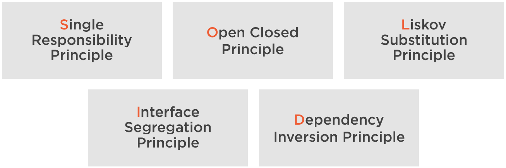
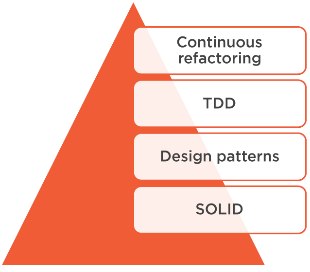

## SOLID principles

Benefits:
- maintainable code
- cost effective
- easy to understand
- faster changes with minimal risk

Also use: constant refactoring, design patterns, unit testing.

**Single responsability Principle**: every function, class or module should have one and only one reason to change.  
Sympthoms:
- monster methods (many responsabilities)
- god classes (like "Utils")
- side effects
- difficult testing
- code dificult to read

**Open Closed Principle** = classes, functions and modules should be closed for modification, but open for extension.  
Closed for modification = every new feature should not modify existing source code.  
Open for extension = a component should be extendable to make it behave in new ways.  

**Liskov Substitution Principle** = any object of a type must be substitutable by objects of a derived type without altering the correctness of that program.  
It is about relationships (inheritance). Incorrect relationships between types cause unexpected bugs or side effects. 
Sympthoms:
- partial implemented interfaces
- empty methods
- type checking
Make sure that a derived class can substitute its base type completely.  
Keep base classes small and focused.  
Keep interfaces lean.  

**Interface Segregation Principle** = Clients should not be forced to depend on methods that they do not use. ISP reinforces Liskov and Single Resp. by:
- keeping interfaces small , the classes that implement them have a higher chance to fully substitute the interface;
- classes that implement small interfaces are more focused and tend to have a single purpose.  
Lean interfaces minimize dependencies on unused members and reduce code coupling.

**Dependency Inversion Principle** = High level modules should not depend on low level modules; both should depend on abstractions (interfaces, abstract classes). Abstractions should not depend on details. Details should depend upon abstraction.

Dependency injection = a technique that allows the creation of dependent objects outside of a class and provides those objects to a class.

Inversion of control = design principle in which the control of object creation, configuration, and lifecycle is passed to a container or framework.
 
DIP, DI, IoC = the most effective ways to eliminate code coupling and kkep systems easy to maintain and evolve.
 
## Clean code

 

## Is it a problem to have comments in code

- it depends
- explaining yourself is good, not needing to do so is better
  
  
- repeating what can be inferred/observed from the code directly
- can be inaccurate
- are not maintained (or take time to maintain)
- compensate for poor coding
- comments should highlight and draw attention to important requirements/contracts/best-practices that are not immediately obvious but have significant impact

## What are TDD steps

This workflow is sometimes called Red-Green-Refactoring, which comes from the status of the tests within the cycle.

- The red phase indicates that code does not work.
- The green phase indicates that everything is working, but not necessary in the most optimal way.
- The blue phase indicates that the tester is refactoring the code, but is confident their code is covered with tests which gives the tester confidence to change and improve our code.

## What libraries that help to write unit tests have you used

JUnit 4

- JUnit is an open source framework, which is used for writing and running tests.
- Provides annotations to identify test methods.
- Provides assertions for testing expected results.
- Provides test runners for running tests.
- JUnit tests allow you to write codes faster, which increases quality.
- JUnit is elegantly simple. It is less complex and takes less time.
- JUnit tests can be run automatically and they check their own results and provide immediate feedback. There's no need to manually comb through a report of test results.
- JUnit tests can be organized into test suites containing test cases and even other test suites.
- JUnit shows test progress in a bar that is green if the test is running smoothly, and it turns red when a test fails

## What is mocking? Have you used any mocking frameworks?

Mocking is primarily used in unit testing. An object under test may have dependencies on other (complex) objects. To isolate the behavior of the object you want to replace the other objects by mocks that simulate the behavior of the real objects. This is useful if the real objects are impractical to incorporate into the unit test.

In short, mocking is creating objects that simulate the behavior of real objects.

- **Dummy** objects are passed around but never actually used. Usually they are just used to fill parameter lists.
- **Fake** objects actually have working implementations, but usually take some shortcut which makes them not suitable for production (an in memory database is a good example).
- **Stubs** provide canned answers to calls made during the test, usually not responding at all to anything outside what's programmed in for the test. Stubs may also record information about calls, such as an email gateway stub that remembers the messages it 'sent', or maybe only how many messages it 'sent'.
- **Mocks**: objects pre-programmed with expectations which form a specification of the calls they are expected to receive.

## Black box vs white box testing

- Black Box Testing is a software testing method in which the internal structure/ design/ implementation of the item being tested <u>is not known</u> to the tester 
 
- White Box Testing is a software testing method in which the internal structure/ design/ implementation of the item being tested <u>is known</u> to the tester

## Functional vs nonfunctional testing

**Functional testing** is a type of testing which verifies that each function of the software application operates in conformance with the requirement specification. This testing mainly involves black box testing, and it is not concerned about the source code of the application.

**Non-functional testing** is a type of testing to check non-functional aspects (performance, usability, reliability, etc.) of a software application. It is explicitly designed to test the readiness of a system as per nonfunctional parameters which are never addressed by functional testing. A good example of non-functional test would be to check how many people can simultaneously login into a software.

## How to test legacy code

unit tests, refactoring