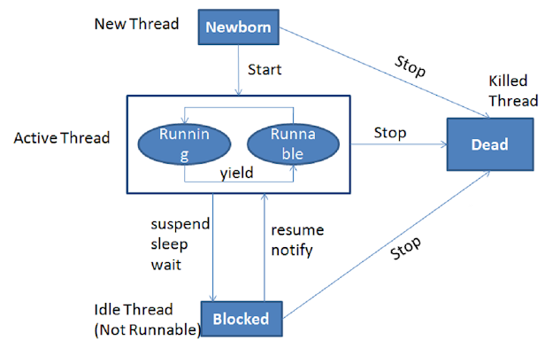

## Thread

A thread in Java is a lightweight process that runs within another process or thread. It is an independent path of execution in an application. JVM gives each thread its own method-call stack.  
When we start JVM, Java starts one thread. This thread calls the main method of the class passed in argument to java call.

**MULTITHREADING** = CPU executes multiple processes or threads concurrently

**BENEFITS:**
- responsive applications
- use more than one processor core
- improved performance

## Thread vs Process

**PROCESS** = an instance of program execution (the OS assigns distinct registers, stack and heap memory to every process)
every process have a PID (process identifier) and memory allocated

**THREAD** = is a unit of execution within a given process (so a process may have several threads)
each thread in a process shares the memory and resources and this is why programmers have to deal with concurrent programming and multithreading

The typical difference between PROCESSES and THREADS (of the same process) run in a shared memory space,
while processes run in separate memory spaces.

**STACK** -> local variables, method arguments, method calls (small, fast)  
**HEAP** -> objects (live as long as are referenced from somewhere in the application) (large, slower)

Every thread has its own stack memory but all threads share the heap memory (shared memory space).  
So every local variable inside a thread are not a concern because threads have their own stack.


## Thread vs Runnable, run() vs start()

```java
public class DemoRunnable implements Runnable {
    public void run() {
        //Code
    }
}
 
//start new thread with a "new Thread(new demoRunnable()).start()" call
```
```java
public class DemoThread extends Thread {
    public DemoThread() {
        super("DemoThread");
    }
    public void run() {
        //Code
    }
}
//start new thread with a "new demoThread().start()" call
```

When a program calls the `start()` method, a new thread <u>is created</u> and then the `run()` method <u>is executed</u>. But if we directly call the run() method then no new thread will be created and run() method will be executed as a normal method call on the current calling thread itself and no multi-threading will take place.

- implementation of Runnable is using composition (prefered) - we are implementing an interface which gives a cleaner separation between our code and the implementation of threads
- Thread class offers us some other methods (which we may need)

## Synchronization of Java Blocks and Methods

Threads communicate primarily by sharing access to fields and the objects reference fields refer to. This form of communication is extremely efficient, but makes two kinds of errors possible: thread interference and memory consistency errors.

Synchronized methods enables a simple strategy for preventing the thread interference and memory consistency errors. If a Object is visible to more than one threads, all reads or writes to that Object’s fields are done through the synchronized method.

If we only need to execute some subsequent lines of code not all lines (instructions) of code within a method, then we should synchronize only block of the code within which required instructions exists.

```java
synchronized(this) {
    // object locking
}
```

- When a thread enters into synchronized method or block, it acquires lock and once it completes its task and exits from the synchronized method, it releases the lock.
- When thread enters into synchronized instance method or block, it acquires object level lock and when it enters into synchronized static method or block it acquires class level lock.
- Java synchronized method run very slowly and can degrade the performance, so you should synchronize the method when it is absolutely necessary otherwise not and to synchronize block only for critical section of the code.

## Explain usage of the couple wait()/notify()



- we are calling `wait()`, `notify()` and `notifyAll()` methods (of Object class) from a synchronized context in Java i.e. inside synchronized method or a synchronized block. The thread must hold the lock on the object it is going to call the wait() or notify() method and that is acquired when it enter into a synchronized context.
- When a thread calls the `wait()` (or `wait(long timeout)`) method in Java, it goes to the wait state by <u>releasing the lock</u>, which is later acquired by the other thread who can notify this thread.
- A thread waiting due to a call to wait() method can <u>wake up</u> either by notification e.g. calling `notify()` or `notifyAll()` method on the same object or due to interruption.
- The wait() method throws InterrruptedException in Java, which is a checked exception.
- Main difference between `notify()` and `notifyAll()` is that in case of notify() only one of the waiting thread gets a notification but in case of notifyAll() all threads get notification.


## Difference between sleep() and wait()

- you call `wait()` on the Object while on the other hand you call `sleep()` on the Thread itself
- wait can be interrupted (this is why we need the InterruptedException) while on the other hand sleep can not
- wait (and notify) must happen in a synchronized block on the monitor object whereas sleep does not
- sleep operation does not release the locks it holds while on the other hand wait releases the lock on the object that wait() is called on


`sleep(n)` says “*I’m done with my timeslice, and please don’t give me another one for at least n milliseconds.*” The OS doesn’t even try to schedule the sleeping thread until requested time has passed.

`yield()` says “*I’m done with my timeslice, but I still have work to do.*” The OS is free to immediately give the thread another timeslice, or to give some other thread or process the CPU the yielding thread just gave up.

`wait()` says “*I’m done with my timeslice. Don’t give me another timeslice until someone calls notify().*” As with sleep(), the OS won’t even try to schedule your task unless someone calls notify() (or one of a few other wakeup scenarios occurs).

## Difference between wait() and join()

The `wait()` and `join()` methods are used to pause the current thread. The `wait()` is used in with `notify()` and `notifyAll()` methods, but `join()` is used to wait until one thread finishes its execution.

`wait()` is mainly used for shared resources, a thread notifies other waiting thread when a resource becomes free. 

On the other hand `join()` is used for waiting a thread to die.

**Similarities between wait() and join()**

- Both are used to pause the current thread.
- Both can be interrupted by calling interrupt() method.
- Both are a non-static method.
- Both are overloaded. 
- Both can accept a timeout parameter (0 default).

**Difference between wait() and join() method**

- Are present different packages: 
    - wait() is declared in java.lang.Object class 
    - join() is declared in java.lang.Thread class.
- wait() is used for inter-thread communication while the join() is used for adding sequencing between multiple threads - one thread starts execution after first thread execution finished.
- We can start a waiting thread (went into this state by calling wait()) by using notify() and notifyAll() method but we can not break the waiting imposed by join without unless or interruption the thread on which join is called has execution finished.
- wait() must be called from synchronized context i.e. synchronized block or method otherwise it will throw `IllegalMonitorStateException` but On the other hand, we can call join() method with and without synchronized context in Java.

## Differences between lock and synchronized block

- synchronized are unfair by default but in case of locks, we can make them fair
- we can check if a given lock is held or not
- we can get a list of threads that are waiting for the given lock

## Atomic operations

An operation acting on shared memory is atomic if it completes in a single step relative to other threads. 

Any time two threads operate on a shared variable concurrently, and one of those operations performs a write, both threads must use atomic operations.

## Livelocks vs Deadlocks

**DEADLOCKS:**
- when two or more threads wait forever for a lock or resource held by another thread
- two or more competing actions are each waiting for the other to finish and thus neither ever does

**LIVELOCKS:**
- one of the threads acts in response to the action of another thread and the other also acts in response to
the action of the first one
- both threads are too busy responding each other so they will not resume work

**HOW TO FIX IT:**
- we can use Lock's interface's tryLock() method
- make sure that each thread acquires the locks in the same order to avoid any cyclic dependency in lock acquisition
- livelocks can be also treated by acquiring locks at random intervals

**Deadlock example:**
```java
import java.util.concurrent.locks.Lock;
import java.util.concurrent.locks.ReentrantLock;

public class Deadlock {

    private Lock lock1 = new ReentrantLock(true);
    private Lock lock2 = new ReentrantLock(true);

    public static void main(String[] args) {

        Deadlock deadlock = new Deadlock();

        new Thread(deadlock::worker1, "worker1").start();
        new Thread(deadlock::worker2, "worker2").start();
    }

    // cyclic dependency:


    public void worker1() {
        lock1.lock();
        System.out.println("Worker1 acquires lock1...");

        try {
            Thread.sleep(300);
        } catch (InterruptedException e) {
            e.printStackTrace();
        }

        lock2.lock();
        System.out.println("Worker1 acquired lock2...");

        lock1.unlock();
        lock2.unlock();
    }

    public void worker2() {
        lock2.lock();
        System.out.println("Worker2 acquires lock2...");

        try {
            Thread.sleep(300);
        } catch (InterruptedException e) {
            e.printStackTrace();
        }

        lock1.lock();
        System.out.println("Worker2 acquired lock1...");

        lock1.unlock();
        lock2.unlock();
    }
}
```

**Livelock example:**
```java
import java.util.concurrent.TimeUnit;
import java.util.concurrent.locks.Lock;
import java.util.concurrent.locks.ReentrantLock;


public class Livelock {

    private Lock lock1 = new ReentrantLock(true);
    private Lock lock2 = new ReentrantLock(true);

    public static void main(String[] args) {

        Livelock livelock = new Livelock();

        new Thread(livelock::worker1, "worker1").start();
        new Thread(livelock::worker2, "worker2").start();
    }


    public void worker1() {

        while (true) {
            try {
                lock1.tryLock(50, TimeUnit.MILLISECONDS);
            } catch (InterruptedException e) {
                e.printStackTrace();
            }

            System.out.println("Worker1 acquires lock1...");
            System.out.println("Worker1 tries to get lock2...");

            if (lock2.tryLock()) {
                System.out.println("Worker1 acquires lock2...");
                lock2.unlock();
            } else {
                System.out.println("Worker1 cannot acquire lock2...");
                continue;
            }

            break;
        }

        lock1.unlock();
        lock2.unlock();
    }

    public void worker2() {
        while (true) {
            try {
                lock2.tryLock(50, TimeUnit.MILLISECONDS);
            } catch (InterruptedException e) {
                e.printStackTrace();
            }

            System.out.println("Worker2 acquires lock2...");
            System.out.println("Worker2 tries to get lock1...");

            if (lock1.tryLock()) {
                System.out.println("Worker2 acquires lock1...");
                lock1.unlock();
            } else {
                System.out.println("Worker2 cannot acquire lock1...");
                continue;
            }

            break;
        }

        lock1.unlock();
        lock2.unlock();
    }
}
```
