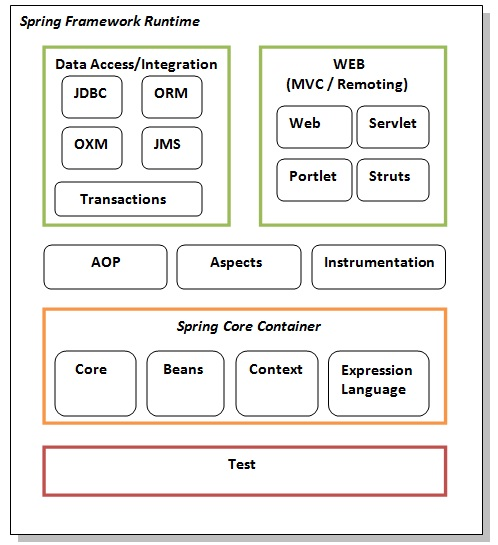

## Basic idea of IoC pattern. Benefits.

Spring IoC is the mechanism to achieve loose-coupling between Objects dependencies. 

To achieve loose coupling and dynamic binding of the objects at runtime, objects dependencies are injected by other assembler objects.  

**Dependency Injection (DI)** is at the heart of Spring. It refers to plugging in references at runtime between many different objects, either through a constructor, setter, or even directly to a field using runtime reflection. This enables **IOC (Inversion of Control)** where one class can use an instance of another class without knowing any details about how that object was constructed or its exact implementation class. Spring’s design allows the use of POJOs (*Plain Old Java Objects*). In other words, you don’t need to implement a specific interface or extend a class in order to use Spring’s DI. An instance of a class configured by Spring is called a Spring Bean, or sometimes just bean for short.

Spring IoC container injects dependencies into an object and make it ready for our use.  
Spring IoC container classes are part of `org.springframework.beans` and `org.springframework.context` packages.  
Spring IoC container provides us different ways to decouple the object dependencies.

## What is Spring configuration?

Beans can be configured in one of three ways: 
- XML, 
- a configuration Java class annotated with **@Configuration**, methods annotated with **@Bean**,
- on the Bean class itself with an annotation such as **@Component**.  

Annotating a class with the `@Configuration` indicates that the class can be used by the Spring IoC container as a source of bean definitions. 

The `@Bean` annotation tells Spring that a method annotated with `@Bean` will return an object that should be registered as a bean in the Spring application context. 

The simplest possible `@Configuration` class would be as follows:

```java
import org.springframework.context.annotation.*;

@Configuration
public class HelloWorldConfig {

   @Bean 
   public HelloWorld helloWorld() {
      return new HelloWorld();
   }
}
```

The above code will be equivalent to the following XML configuration:

```xml
<beans>
   <bean id = "helloWorld" class = "com.example.HelloWorld" />
</beans>
```

Here, the method name is annotated with `@Bean` works as bean ID and it creates and returns the actual bean. Your configuration class can have a declaration for more than one `@Bean`. Once your configuration classes are defined, you can load and provide them to Spring container using `AnnotationConfigApplicationContext` as follows:

```java
public class HelloWorld {
   private String message;

   public void setMessage(String message){
      this.message  = message;
   }
   public void getMessage(){
      System.out.println("Your Message : " + message);
   }
}
```

In main app: 

```java
public static void main(String[] args) {
   ApplicationContext ctx = new AnnotationConfigApplicationContext(HelloWorldConfig.class);
   
   HelloWorld helloWorld = ctx.getBean(HelloWorld.class);
   helloWorld.setMessage("Hello World!");
   helloWorld.getMessage();
}
```

You can load various configuration classes as follows:

```java
public static void main(String[] args) {
   AnnotationConfigApplicationContext ctx = new AnnotationConfigApplicationContext();

   ctx.register(AppConfig.class, OtherConfig.class);
   ctx.register(AdditionalConfig.class);
   ctx.refresh();

   MyService myService = ctx.getBean(MyService.class);
   myService.doStuff();
}
```

Other configuration files can be imported using **@Import**. If needed, you can also use an **@ImportResource** annotation
to load XML configuration files:
```java
@Import({WebConfig.class, ServiceConfig.class})
@ImportResource("dao.xml")
```
This would import the WebConfig and ServiceConfig configuration classes and the dao.xml Spring configuration file.

## What is Component Scanning?

You can use component scanning in Spring to scan classes for certain annotations on the class declaration. Those annotations are **@Component**, **@Controller**, **@Service**, and **@Repository** (and **@Configuration**). If they are found, Spring will initialize that POJO as a Spring Bean.

@Controller, @Service, and @Repository are called **stereotypes**.

Component scanning can be configured through XML like the following:
```xml
<context:component-scan base-package="com.example"/>
```
or in a configuration class like this:
```java
@Configuration
@ComponentScan("com.example")
public class Configuration { ... }
```
In these examples, the “com.example” package and all of its subpackages will be scanned for Spring annotations to create beans. Be careful not to scan too many classes as this will slow down initialization time.

## Out of the box bean scopes (singleton, prototype, request, session, global session)

Scopes defined for Spring Beans:

- **singleton** – Only one instance of the bean will be created for each container. This is the default scope for the spring beans. While using this scope, make sure bean doesn’t have shared instance variables otherwise it might lead to data inconsistency issues.

- **prototype** – A new instance will be created every time the bean is requested.

Web-Aware ApplicationContext bean scopes:

- **request** – This is same as prototype scope, however it’s meant to be used for web applications. A new instance of the bean will be created for each HTTP request.

- **session** – A new bean will be created for each HTTP session by the container.

- **global-session** – This is used to create global session beans for Portlet applications.

Spring Framework is extendable and we can create our own scopes too. However, most of the times we are good with the scopes provided by the framework.

Beans are created eagerly by default – which means Spring will instantiate them and wire them up at start-up time. This makes it faster to find any potential problems. You can make a Bean load lazily using the **@Lazy** annotation if you don’t want it to load until necessary (when requested for using the ApplicationContext.getBean(String) method or requested by, e.g., autowiring).

## Autowiring. Types of autowiring.

The Spring framework enables automatic dependency injection. In other words, by declaring all the bean dependencies in a Spring configuration file, Spring container can **autowire relationships between collaborating beans**. This is called Spring bean autowiring.

After enabling annotation injection, we can use **autowiring on properties, setters, and constructors**.

To enable **@Autowired** annotation we can enable annotation-driven injection by using below spring configuration:

```java
@Configuration
@ComponentScan("com.example.autowiringdemo")
public class AppConfig {}
```

## What are the types of Dependency Injection Spring supports

- **Attribute** (property) based injection
- **Constructor** based injection
- **Setter** based injection

As per Spring documentation:
- We should use constructor injection for mandatory dependencies
- We should use setter-based injections for optional dependencies
- Field-based injection is a costlier approach and we should avoid using it (Spring uses reflection for field based injection)

Annotate a setter or field with **@Autowired** on a
Spring Bean, and Spring will find the class at runtime that best matches that field or setter. By default, it will search for the class matching the type. If it can’t find a matching bean or there is more than one possible match (after considering any **@Qualifier** annotation and the name), Spring will throw an Exception and fail to start.  
You can use @Qualifier to specify a specific name of an instance to help @Autowired find the right instance when many instances of the same class or interface might exist.

## How to run a Spring Boot App from the command line

- First alternative:
    - from the Linux console, get to the Spring Boot App root directory
    - run with: `./mvnw spring-boot:run`
    - exit with `Ctrl + C`
- Second version:
    - from the Linux console, get to the Spring Boot App root directory
    - package the app (jar) with `./mvnw package`
    - the jar will be packaged into target folder
    - `cd target`
    - run the app with `java -jar spring-0.0.1-SNAPSHOT.jar` or whatever the name of the application (can look up with `ls`)

## What are inner beans

In Spring framework, whenever a bean is used for only one particular property, it’s advise to declare it as an inner bean. And the inner bean is supported both in setter injection ‘property‘ and constructor injection ‘constructor-arg‘. Like Inner classes are the classes which are defined inside the scope of another class. Similarly inner beans are the beans which are defined in the scope of another bean.

## What modules does Spring Framework have



## Why is Spring AOP useful

AOP stands for aspect-oriented programming. AOP allows you to address cross-cutting concerns, such as logging, transaction management,security, and caching, without repeating the same code over and over. It allows you to apply the DRY (Do not Repeat Yourself ) principle.  
Spring AOP can only advise public, nonstatic methods on Spring Beans.