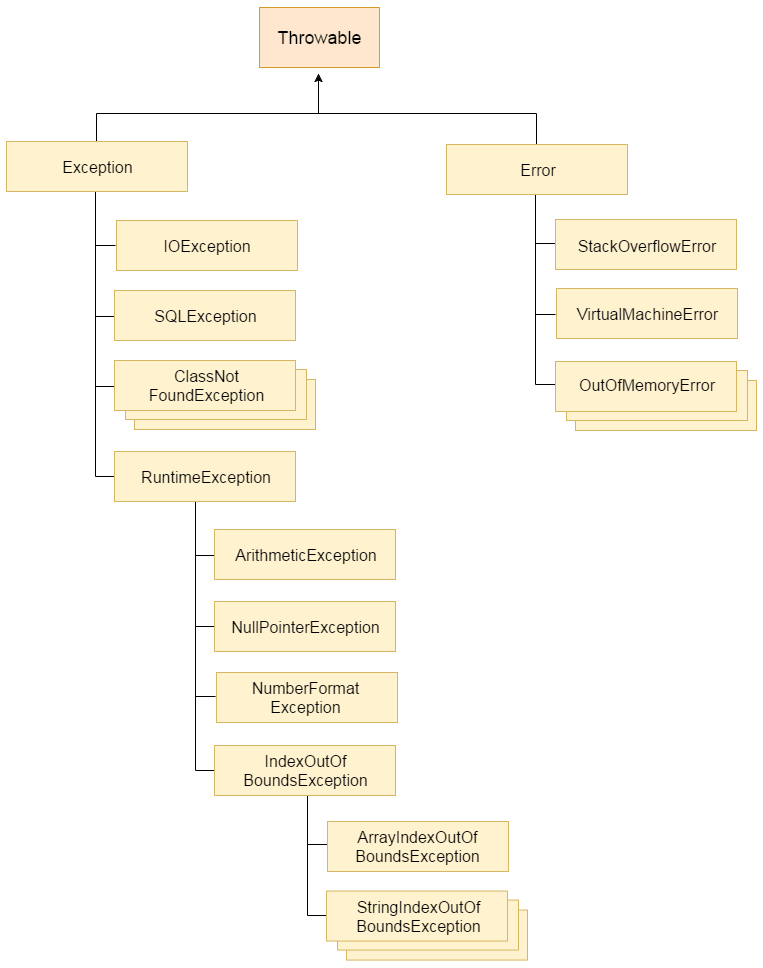

## Length in bytes for primitive types

| Data Type | Size    | Description                              |
|-----------|---------|------------------------------------------|
| byte      | 1 byte  | Stores whole numbers from -128 to 127    |
| short     | 2 bytes | Stores whole numbers from -32,768 to 32,767 |
| int       | 4 bytes | Stores whole numbers from -2,147,483,648 to 2,147,483,647 |
| long      | 8 bytes | Stores whole numbers from -9,223,372,036,854,775,808 to 9,223,372,036,854,775,807 |
| float     | 4 bytes | Stores fractional numbers. Sufficient for storing 6 to 7 decimal digits |
| double    | 8 bytes | Stores fractional numbers. Sufficient for storing 15 decimal digits |
| boolean   | 1 bit   | Stores true or false values              |
| char      | 2 bytes | Stores a single character/letter or ASCII values |


## Keywords: static, final, transient, strictfp, volatile

**static** =  share the same variable or method of a given class. (variables, methods, blocks and nested classes)   
**final** = define an entity that can only be assigned once. Once a final variable has been assigned, it always contains the same value. For classes, a final class will not be inherited  
**transient** = used when a member variable not to be serialized when it is persisted to streams of bytes (security constraint). (so, instead of being serialized, the variable will be reduced to its default value.  
**strictfp** =  used for restricting floating-point calculations and ensuring same result on every platform while performing operations in the floating-point variable.  
**volatile** = another way (like synchronized, atomic wrapper) of making class thread safe (method or class instance can be used by multiple threads at the same time without any problem). Volatile variables have the visibility features of synchronized but not the atomicity features. The values of volatile variable will never be cached and all writes and reads will be done to and from the main memory. 

## Default values for data types

| Data Type                | Default Value (for fields) |
|--------------------------|----------------------------|
| byte                     | 0                          |
| short                    | 0                          |
| int                      | 0                          |
| long                     | 0L                         |
| float                    | 0.0f                       |
| double                   | 0.0d                       |
| char                     | '\u0000'                   |
| String (or any object)   | null                       |
| boolean                  | false                      |

## Reflection, introspection

The name reflection is used to modify (describe) code which is able to inspect other code in the same system (or itself).

> The ability to inspect the code in the system and see object types is not reflection, but rather Type Introspection. Reflection is then the ability to make modifications at runtime by making use of introspection. The distinction is necessary here as some languages support introspection, but do not support reflection. One such example is C++


For example, say you have an object of an unknown type in Java, and you would like to call a 'doSomething' method on it if one exists. Java's static typing system isn't really designed to support this unless the object conforms to a known interface, but using reflection, your code can look at the object and find out if it has a method called 'doSomething' and then call it if you want to.

So, to give you a code example of this in Java (imagine the object in question is foo) :

```java
Method method = foo.getClass().getMethod("doSomething", null); // introspect
method.invoke(foo, null); // reflection
```

One very common use case in Java is the usage with annotations. JUnit 4, for example, will use reflection to look through your classes for methods tagged with the **@Test** annotation, and will then call them when running the unit test.

Another example:

```java
// A simple Java program to demonstrate the use of reflection 
import java.lang.reflect.Method; 
import java.lang.reflect.Field; 
import java.lang.reflect.Constructor; 

// class whose object is to be created 
class Test 
{ 
	// creating a private field 
	private String s; 

	// creating a public constructor 
	public Test() { s = "GeeksforGeeks"; } 

	// Creating a public method with no arguments 
	public void method1() { 
		System.out.println("The string is " + s); 
	} 

	// Creating a public method with int as argument 
	public void method2(int n) { 
		System.out.println("The number is " + n); 
	} 

	// creating a private method 
	private void method3() { 
		System.out.println("Private method invoked"); 
	} 
} 

class Demo 
{ 
	public static void main(String args[]) throws Exception 
	{ 
		// Creating object whose property is to be checked 
		Test obj = new Test(); 

		// Creating class object from the object using 
		// getclass method 
		Class cls = obj.getClass(); 
		System.out.println("The name of class is " + cls.getName()); 

		// Getting the constructor of the class through the 
		// object of the class 
		Constructor constructor = cls.getConstructor(); 
		System.out.println("The name of constructor is " + constructor.getName()); 

		System.out.println("The public methods of class are : "); 

		// Getting methods of the class through the object 
		// of the class by using getMethods 
		Method[] methods = cls.getMethods(); 

		// Printing method names 
		for (Method method:methods) 
			System.out.println(method.getName()); 

		// creates object of desired method by providing the 
		// method name and parameter class as arguments to 
		// the getDeclaredMethod 
		Method methodcall1 = cls.getDeclaredMethod("method2", int.class); 

		// invokes the method at runtime 
		methodcall1.invoke(obj, 19); 

		// creates object of the desired field by providing 
		// the name of field as argument to the 
		// getDeclaredField method 
		Field field = cls.getDeclaredField("s"); 

		// allows the object to access the field irrespective 
		// of the access specifier used with the field 
		field.setAccessible(true); 

		// takes object and the new value to be assigned 
		// to the field as arguments 
		field.set(obj, "JAVA"); 

		// Creates object of desired method by providing the 
		// method name as argument to the getDeclaredMethod 
		Method methodcall2 = cls.getDeclaredMethod("method1"); 

		// invokes the method at runtime 
		methodcall2.invoke(obj); 

		// Creates object of the desired method by providing 
		// the name of method as argument to the 
		// getDeclaredMethod method 
		Method methodcall3 = cls.getDeclaredMethod("method3"); 

		// allows the object to access the method irrespective 
		// of the access specifier used with the method 
		methodcall3.setAccessible(true); 

		// invokes the method at runtime 
		methodcall3.invoke(obj); 
	} 
}
```

## Serialization

When an object is transferred through the network, the object needs to be 'serialized'. Serialization converts the object state to serial bytes.

## this' and 'super' keywords

*super* as well as *this* are used to make constructor calls. *super* is used to call Base class’s constructor(i.e, Parent’s class) while *this* is used to call current class’s constructor.

## Contract between equals() and hashCode()

The **equals()** method of Object class checks the equality of the objects and accordingly it returns true or false. *The default implementation, as provided by Object class, checks the equality of the objects on the basis if both references refer to the same object*. It does not check the value or state of the objects. But we can override this method to provide own implementation to compare the state or value of the objects.  
**hashCode()** method returns an integer value, which is referred to as the hash code value of an object. Every Object, at the time of creation assigned with a unique 32-bit, signed int value. This value is the hash code value of that object.  
Equals consistency: objects that are equal to each other must return the same hashCode.  
If we override equals(), we must also override hashCode() or else, if we create 2 objects with the same state, they will have different hashCode.  
[LINK: implement-equals-method-correctly](https://www.sitepoint.com/implement-javas-equals-method-correctly/)  
[LINK: implement-hashcode-method-correctly](https://www.sitepoint.com/how-to-implement-javas-hashcode-correctly/)

## Rules to create equals method

- **Reflexive**: x.equals(x) == true , an object must equal to itself.  
- **Symmetry**: if(x.equals(y)==true) then y.equals(x) == true.  
- **Transitive**: if x.equals(y) and y.equals(z); then x.equals(z)  
- **Consistent**: if x.equals(y)==true and no value is modified, then it’s always true for every call  
- For any non-null object x, x.equals(null)==false

## Access modifiers in Java

| Access Modifier                          | within class | within package | outside package by subclass only | outside package |
|------------------------------------------|--------------|----------------|----------------------------------|-----------------|
| <b style="color: rgba(0, 0, 0, 0.75);">Private | Y            | N              | N                                | N               |
| <b style="color: rgba(0, 0, 0, 0.75);">Default | Y            | Y              | N                                | N               |
| <b style="color: rgba(0, 0, 0, 0.75);">Protected | Y            | Y              | Y                                | N               |
| <b style="color: rgba(0, 0, 0, 0.75);">Public | Y            | Y              | Y                                | Y               |

!! protected will permit access to child classes even if they are in another package. Also will permit access to all classes within the same package.

## What different between StringBuffer and StringBuilder

Java provides three classes to represent a sequence of characters: 
- String, 
- StringBuffer 
- StringBuilder 

The String class is an immutable class whereas StringBuffer and StringBuilder classes are mutable.

StringBuilder is more efficient than StringBuffer, but it is not synchronized (not thread safe). StringBuffer is thread safe.

## Purpose, types and creation of nested classes

- Nested class = a class within another class
- nested class does not exists independently of outer class
- NC has access to all members of enclosing class (however the reverse is not true)
- NC is also a member of its enclosing class
- there are to type of nested classes:
    - static nested class: are declared static. In this case, without an outer class object existing, there may be a static nested class object. i.e., an object of a static nested class is not strongly associated with the outer class object. `OuterClass.StaticNestedClass nestedObject = new OuterClass.StaticNestedClass();`
    - inner class:  non-static nested class. To instantiate an inner class, you must first instantiate the outer class. Then, create the inner object within the outer object: `OuterClass.InnerClass innerObject = outerObject.new InnerClass();`
      - local inner class
      - anonymous inner class

## What does it mean that an object or a class is mutable or immutable

| Mutable                                  | Immutable                                |
|------------------------------------------|------------------------------------------|
| Fields can be changed after the object creation | Fields cannot be changed after object creation. Immutability makes it easier to parallelize your program as there are no conflicts among objects. |
| Generally provides a method to modify the field value | Does not have any method to modify the field value |
| Has Getter and Setter methods            | Has only Getter method                   |
| Example: StringBuilder, java.util.Date   | Example: String, Boxed primitive objects (wrapper classes) like Integer, Long and etc |

## Regular vs. static initialization blocks

```java
public class Test {
    {
        System.out.println("Empty block");
    }
    
    static {
        System.out.println("Static block");
    }
    
    public static void main(String[] args) {
        Test t = new Test();
    }
}
```
The static initializer block will be called on loading of the class, and will have no access to instance variables or methods.It is often used to create static variables.  
The non-static initializer block on the other hand is created on object construction only, will have access to instance variables and methods, and will be called at the beginning of the constructor, after the super constructor has been called (either explicitly or implicitly) and before any other subsequent constructor code is called. Used when a class has multiple constructors and needs the same initialization code called for all constructors. Just as with constructors, we should avoid calling non-final methods in this block.

## What is a parameterized or generic type

- A generic type is a type with formal type parameters. A generic type is a reference type that has one or more type parameters. These type parameters are later replaced by type arguments when the generic type is instantiated (or declared ). 

```java
interface Collection<E>  { 
  public void add (E x); 
  public Iterator<E> iterator();
}
```

- A parameterized type is an instantiation of a generic type with actual type arguments.

```java
Collection<String> coll = new LinkedList<String>();
```


## What is Autoboxing and what are its advantages/pitfalls

**Autoboxing**: Converting a primitive value into an object of the corresponding wrapper class is called autoboxing. For example, converting int to Integer class. 

**Unboxing**: Converting an object of a wrapper type to its corresponding primitive value is called unboxing. For example conversion of Integer to int. 

- Autoboxing and unboxing lets developers write cleaner code, making it easier to read.
- The technique let us use primitive types and Wrapper class objects interchangeably and we do not need to perform any typecasting explicitly.

Autoboxing pitfalls:
- Performance
- Confused Equals
- Caching of Primitive by Wrapper Classes
- Ambiguous Method Calls

## What is Lambda expression (Java 8)

A lambda expression is a short block of code which takes in parameters and returns a value. Lambda expressions are similar to methods, but they do not need a name and they can be implemented right in the body of a method.

```java
numbers.forEach( (n) -> { 
                            System.out.println(n); 
                        } );
```

## What difference between float and BigDecimal? How they store the data?

- BigDecimal (base-10) is a class, float (base-2) is a primitive
- BigDecimal is able to represent very precise decimal values (when we really need accurate computations)
- BigDecimal will not round automatically, or loses precision (except 2/3)
- BigDecimal take up more memory
- BigDecimal are stored in heap (float in stack)

## Java object references

A reference is an address that indicates where an object's variables and methods are stored. Example a = new Example(); here a is actually a reference which is pointing to memory assigned (in heap) using new keyword.  

## What is deep copy of a Java object

**Deep copy** of an object will have exact copy of all the fields of original object just like shallow copy. But in additional, if original object has any references to other objects as fields, then copy of those objects are also created by calling clone() method on them.

A **shallow copy** is one in which we only copy values of fields from one object to another (and keep references to other objects from fields).

## Checked vs. unchecked exceptions. Why would one use former or later?

**Unchecked** are the exceptions that are not checked at compiled time. In C++, all exceptions are unchecked, so it is not forced by the compiler to either handle or specify the exception. It is up to the programmers to be civilized, and specify or catch the exceptions.
In Java exceptions under Error and RuntimeException classes are unchecked exceptions, everything else under throwable is checked.

```java
class Main { 
   public static void main(String args[]) { 
      int x = 0; 
      int y = 10; 
      int z = y/x; 
  } 
}
```
`Exception in thread "main" java.lang.ArithmeticException: / by zero
    at Main.main(Main.java:5)
Java Result: 1`

**Checked** are the exceptions that are checked at compile time. If some code within a method throws a checked exception, then the method must either handle the exception or it must specify the exception using throws keyword.

```java
import java.io.*; 
  
class Main { 
    public static void main(String[] args) throws IOException { 
        FileReader file = new FileReader("C:\\test\\a.txt"); 
        BufferedReader fileInput = new BufferedReader(file); 
          
        // Print first 3 lines of file "C:\test\a.txt" 
        for (int counter = 0; counter < 3; counter++)  
            System.out.println(fileInput.readLine()); 
          
        fileInput.close(); 
    } 
}
```



## Could we have only try and finally without catch

Yes,  we can have try without catch block by using finally block.
You can use try with finally. As you know finally block always executes even if you have exception or return statement in try block except in case of System.exit().

## Cases when the finally block isn't executed

If the JVM exits while the try or catch code is being executed, then the finally block may not execute. Likewise, if the thread executing the try or catch code is interrupted or killed, the finally block may not execute even though the application as a whole continues.

```java
try {
        System.out.println("hello");
        System.exit(0);
    }
    finally {
        System.out.println("bye");
    }
```

## Difference in Error and UncheckedException

An Error is a subclass of Throwable that indicates serious problems that a reasonable application should not try to catch. Most such errors are abnormal conditions. The ThreadDeath error, though a "normal" condition, is also a subclass of Error because most applications should not try to catch it.  
The class Exception and its subclasses are a form of Throwable that indicates conditions that a reasonable application might want to catch.  
So, even though an unchecked exception is not required to be caught, you may want to. An error, you don't want to catch

## What is exception handling mechanism

Exception Handling is a mechanism to handle runtime errors such as ClassNotFoundException, IOException, SQLException, RemoteException, etc. The core advantage of exception handling is to maintain the normal flow of the application. An exception normally disrupts the normal flow of the application that is why we use exception handling.

## What is try-with-resources 

Support for try-with-resources – introduced in Java 7 – allows us to declare resources to be used in a try block with the assurance that the resources will be closed when after the execution of that block. Simply put, to be auto-closed, a resource must be both declared and initialized inside the *try*.

```java
Scanner scanner = null;
try {
    scanner = new Scanner(new File("test.txt"));
    while (scanner.hasNext()) {
        System.out.println(scanner.nextLine());
    }
} catch (FileNotFoundException e) {
    e.printStackTrace();
} finally {
    if (scanner != null) {
        scanner.close();
    }
}
```
**vs**
```java
try (Scanner scanner = new Scanner(new File("test.txt"))) {
    while (scanner.hasNext()) {
        System.out.println(scanner.nextLine());
    }
} catch (FileNotFoundException e) {
    e.printStackTrace();
}
```

