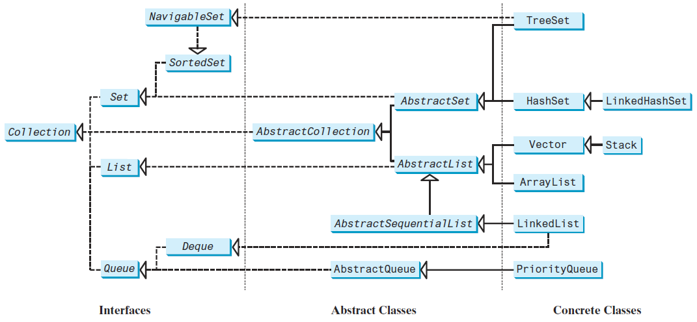
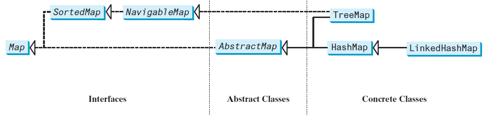

## General collection interfaces (Collection, Set, Map, List, Queue, SortedSet, SortedMap)

The <u>Collection interface</u> defines the common operations for lists, vectors, stacks, queues, priority queues, and sets. Methods provided are at instance level.  
<u>Collections is a utility class</u> that provides methods like sorting and synchronizing collection elements. Most methods provided are static that can work on an instance of Collection (interface). 

The Java Collections Framework supports two types of containers:
- one for storing a collection of elements is simply called a collection, 
- the other, for storing key/value pairs, is called a map.  

The Java Collections Framework:
- SETS store a group of nonduplicate elements.
- LISTS store an ordered collection of elements.
- STACKS store objects that are processed in a last-in, first-out fashion.
- QUEUES store objects that are processed in a first-in, first-out fashion.
- PRIORITYQueues store objects that are processed in the order of their priorities.

## Interfaces extending Collection. Is Map part of Collection interface

No, Map is not part of Collection interface. It's a part of Collections Framework.

## ArrayList vs LinkedList

The **ArrayList** class and the **LinkedList** class are two concrete implementations of the List interface. **ArrayList** stores elements in an array. The array is dynamically created. If the capacity of the array is exceeded, a larger new array is created and all the elements from
the current array are copied to the new array. **LinkedList** stores elements in a linked list.   
If you need to support random access through an index without inserting or removing elements at the beginning of the list, ArrayList is the most efficient. If, however, your application requires the insertion or deletion of elements at the beginning of the list, you should choose LinkedList. A list can grow or shrink dynamically. Once it is created, an array is fixed. If your application does not require the insertion or deletion of elements, an array is the most efficient data structure.

## Vector and PriorityQueue

**Vector** is the same as ArrayList, except that it contains synchronized methods for accessing and modifying the vector. Synchronized methods can prevent data corruption when a vector
is accessed and modified by two or more threads concurrently. For the many applications that do not require synchronization, using ArrayList is more efficient than using Vector.  

**PriorityQueue** class implements a priority queue. By default, the priority queue orders its elements according to their natural ordering using Comparable. The element with the least value is assigned the highest priority, and thus is removed from the queue first. If there are several elements with the same highest priority, the tie is broken arbitrarily. You can also specify an ordering using Comparator in the constructor PriorityQueue(initialCapacity, comparator).

## List vs Set

LISTS: 
- ordered sequence of elements;
- we can insert elements in a certain position indicated by index
- can hold duplicate elements

SETS:  
- unordered elements
- no positional insertion (unsorted)
- no duplicate elements

## Treeset vs. HashSet

|                    | TreeSet            | HashSet                       |
|--------------------|--------------------|-------------------------------|
| **Ordering**           | Natural ordering   | Random order                  |
| **Null value element** | Not allowed        | Can store a null value object |
| **Performance**       | log(n) time        | constant time                 |
| **Speed**          | lower than HashSet |                               |
| **Internal structure** | NavigableMap       | HashMap                       |
| **Element comparison** | uses compareTo() | uses equals() |

## TreeSet vs TreeMap

A **set** is an efficient data structure for storing and processing nonduplicate elements.  
A **map** is like a dictionary that provides a quick lookup to retrieve a value using a key.

Sets are more efficient than lists for storing nonduplicate elements. Lists are useful for accessing elements through the index.

Set has three concrete classes: HashSet, LinkedHashSet, TreeSet.

A **HashSet** can be used to store duplicate-free elements.

**LinkedHashSet** extends HashSet with a linked-list implementation that supports an ordering of the elements in the set. The elements in a HashSet are not ordered, but the elements in a LinkedHashSet can be retrieved in the order in which they were inserted into the set.

SortedSet is a subinterface of Set, which guarantees that the
elements in the set are sorted. **TreeSet** implements the SortedSet interface.  

A **map** is a container object that stores a collection of key/value pairs. It enables fast retrieval, deletion, and updating of the pair through the key. A map stores the values along with the keys.
The keys are like indexes. In List, the indexes are integers. In Map, the keys can be any objects. A map cannot contain duplicate keys. Each key maps to one value. A key and its corresponding value form an entry stored in a map,

The **HashMap** class is efficient for locating a value, inserting an entry, and deleting an entry. **LinkedHashMap** extends HashMap with a linked-list implementation that supports an ordering of the entries in the map. The entries in a HashMap are not ordered, but the entries in a LinkedHashMap can be retrieved either in the order in which they were inserted into the map (known as the insertion order) or in the order in which they were last accessed, from least recently to most recently accessed (access order).
The **TreeMap** class is efficient for traversing the keys in a sorted order. The keys can be sorted using the Comparable interface or the Comparator interface.

## Thread-Safe Classes in Collections Framework

- Stack
- Vector
- Hashtable
- BlockingQueue
- ConcurrentMap
- ConcurrentNavigableMap
- Properties