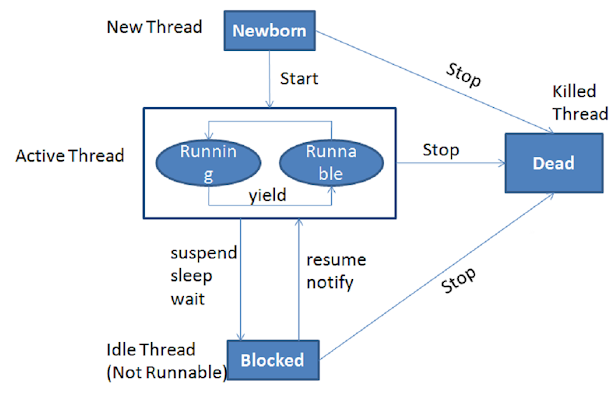

## Thread vs Runnable, run() vs start()

```java
public class DemoRunnable implements Runnable {
    public void run() {
        //Code
    }
}
 
//start new thread with a "new Thread(new demoRunnable()).start()" call
```
```java
public class DemoThread extends Thread {
    public DemoThread() {
        super("DemoThread");
    }
    public void run() {
        //Code
    }
}
//start new thread with a "new demoThread().start()" call
```

When a program calls the `start()` method, a new thread <u>is created</u> and then the `run()` method <u>is executed</u>. But if we directly call the run() method then no new thread will be created and run() method will be executed as a normal method call on the current calling thread itself and no multi-threading will take place.

- implementation of Runnable is using composition (prefered) - we are implementing an interface which gives a cleaner separation between our code and the implementation of threads
- Thread class offers us some other methods (which we may need)

## Synchronization of java blocks and methods

Threads communicate primarily by sharing access to fields and the objects reference fields refer to. This form of communication is extremely efficient, but makes two kinds of errors possible: thread interference and memory consistency errors.

Synchronized methods enables a simple strategy for preventing the thread interference and memory consistency errors. If a Object is visible to more than one threads, all reads or writes to that Object’s fields are done through the synchronized method.

If we only need to execute some subsequent lines of code not all lines (instructions) of code within a method, then we should synchronize only block of the code within which required instructions are exists.

```java
synchronized(this) {
    
}
```

- When a thread enters into synchronized method or block, it acquires lock and once it completes its task and exits from the synchronized method, it releases the lock.
- When thread enters into synchronized instance method or block, it acquires object level lock and when it enters into synchronized static method or block it acquires class level lock.
- Java synchronized method run very slowly and can degrade the performance, so you should synchronize the method when it is absolutely necessary otherwise not and to synchronize block only for critical section of the code.

## Explain usage of the couple wait()/notify()



- we are calling `wait()`, `notify()` and `notifyAll()` methods (of Object class) from a synchronized context in Java i.e. inside synchronized method or a synchronized block. The thread must hold the lock on the object it is going to call the wait() or notify() method and that is acquired when it enter into a synchronized context.
- When a thread calls the `wait()` (or `wait(long timeout)`) method in Java, it goes to the wait state by <u>releasing the lock</u>, which is later acquired by the other thread who can notify this thread.
- A thread waiting due to a call to wait() method can <u>wake up</u> either by notification e.g. calling `notify()` or `notifyAll()` method on the same object or due to interruption.
- The wait() method throws InterrruptedException in Java, which is a checked exception.
- Main difference between notify() and notifyAll() is that in case of notify() only one of the waiting thread gets a notification but in case of notifyAll() all thread get notification

**Sender - Receiver application**:
- The Sender is supposed to send a data packet to the Receiver
- The Receiver cannot process the data packet until the Sender is finished sending it
- Similarly, the Sender mustn't attempt to send another packet unless the Receiver has already processed the previous packet

```java
public class Data {
    private String packet;
    
    // True if receiver should wait
    // False if sender should wait
    private boolean transfer = true;
 
    public synchronized void send(String packet) {
        while (!transfer) {
            try { 
                wait();
            } catch (InterruptedException e)  {
                Thread.currentThread().interrupt(); 
                Log.error("Thread interrupted", e); 
            }
        }
        transfer = false;
        
        this.packet = packet;
        notifyAll();
    }
 
    public synchronized String receive() {
        while (transfer) {
            try {
                wait();
            } catch (InterruptedException e)  {
                Thread.currentThread().interrupt(); 
                Log.error("Thread interrupted", e); 
            }
        }
        transfer = true;
 
        notifyAll();
        return packet;
    }
}
```
```java
public class Sender implements Runnable {
    private Data data;
 
    // standard constructors
 
    public void run() {
        String packets[] = {
          "First packet",
          "Second packet",
          "Third packet",
          "Fourth packet",
          "End"
        };
 
        for (String packet : packets) {
            data.send(packet);
 
            // Thread.sleep() to mimic heavy server-side processing
            try {
                Thread.sleep(ThreadLocalRandom.current().nextInt(1000, 5000));
            } catch (InterruptedException e)  {
                Thread.currentThread().interrupt(); 
                Log.error("Thread interrupted", e); 
            }
        }
    }
}
```
```java
public class Receiver implements Runnable {
    private Data load;
 
    // standard constructors
 
    public void run() {
        for(String receivedMessage = load.receive();
          !"End".equals(receivedMessage);
          receivedMessage = load.receive()) {
            
            System.out.println(receivedMessage);
 
            // ...
            try {
                Thread.sleep(ThreadLocalRandom.current().nextInt(1000, 5000));
            } catch (InterruptedException e) {
                Thread.currentThread().interrupt(); 
                Log.error("Thread interrupted", e); 
            }
        }
    }
}
```
```java
public class SendReceive {
    public static void main(String[] args) {
        Data data = new Data();
        Thread sender = new Thread(new Sender(data));
        Thread receiver = new Thread(new Receiver(data));
    
        sender.start();
        receiver.start();
    }
}
```

## Difference between sleep and wait

A wait can be "woken up" by another thread calling notify on the monitor which is being waited on whereas a sleep cannot. Also a wait (and notify) must happen in a block synchronized on the monitor object whereas sleep does not.

`sleep(n)` says “*I’m done with my timeslice, and please don’t give me another one for at least n milliseconds.*” The OS doesn’t even try to schedule the sleeping thread until requested time has passed.

`yield()` says “*I’m done with my timeslice, but I still have work to do.*” The OS is free to immediately give the thread another timeslice, or to give some other thread or process the CPU the yielding thread just gave up.

`wait()` says “*I’m done with my timeslice. Don’t give me another timeslice until someone calls notify().*” As with sleep(), the OS won’t even try to schedule your task unless someone calls notify() (or one of a few other wakeup scenarios occurs).

## Atomic operations

An operation acting on shared memory is atomic if it completes in a single step relative to other threads. 

Any time two threads operate on a shared variable concurrently, and one of those operations performs a write, both threads must use atomic operations.