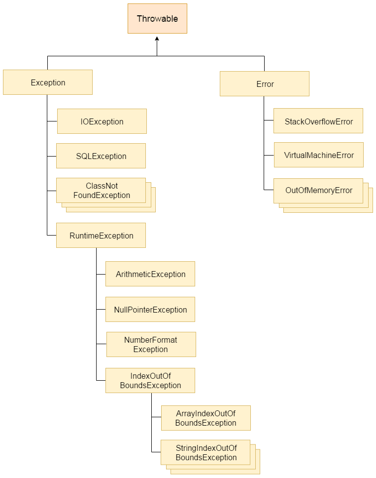

## Checked vs. unchecked exceptions. Why would one use former or later?

**Unchecked** are the exceptions that are not checked at compiled time. In C++, all exceptions are unchecked, so it is not forced by the compiler to either handle or specify the exception. It is up to the programmers to be civilized, and specify or catch the exceptions.
In Java exceptions under Error and RuntimeException classes are unchecked exceptions, everything else under throwable is checked.

```java
class Main { 
   public static void main(String args[]) { 
      int x = 0; 
      int y = 10; 
      int z = y/x; 
  } 
}
```
`Exception in thread "main" java.lang.ArithmeticException: / by zero
    at Main.main(Main.java:5)
Java Result: 1`

**Checked** are the exceptions that are checked at compile time. If some code within a method throws a checked exception, then the method must either handle the exception or it must specify the exception using throws keyword.

```java
import java.io.*; 
  
class Main { 
    public static void main(String[] args) throws IOException { 
        FileReader file = new FileReader("C:\\test\\a.txt"); 
        BufferedReader fileInput = new BufferedReader(file); 
          
        // Print first 3 lines of file "C:\test\a.txt" 
        for (int counter = 0; counter < 3; counter++)  
            System.out.println(fileInput.readLine()); 
          
        fileInput.close(); 
    } 
}
```



## Could we have only try and finally without catch

Yes,  we can have try without catch block by using finally block.
You can use try with finally. As you know finally block always executes even if you have exception or return statement in try block except in case of System.exit().

## Cases when the finally block isn't executed

If the JVM exits while the try or catch code is being executed, then the finally block may not execute. Likewise, if the thread executing the try or catch code is interrupted or killed, the finally block may not execute even though the application as a whole continues.

```java
try {
        System.out.println("hello");
        System.exit(0);
    }
    finally {
        System.out.println("bye");
    }
```

## Difference in Error and UncheckedException

An Error is a subclass of Throwable that indicates serious problems that a reasonable application should not try to catch. Most such errors are abnormal conditions. The ThreadDeath error, though a "normal" condition, is also a subclass of Error because most applications should not try to catch it.  
The class Exception and its subclasses are a form of Throwable that indicates conditions that a reasonable application might want to catch.  
So, even though an unchecked exception is not required to be caught, you may want to. An error, you don't want to catch

## What is exception handling mechanism

Exception Handling is a mechanism to handle runtime errors such as ClassNotFoundException, IOException, SQLException, RemoteException, etc. The core advantage of exception handling is to maintain the normal flow of the application. An exception normally disrupts the normal flow of the application that is why we use exception handling.

## What is try-with-resources 

Support for try-with-resources – introduced in Java 7 – allows us to declare resources to be used in a try block with the assurance that the resources will be closed when after the execution of that block. Simply put, to be auto-closed, a resource must be both declared and initialized inside the *try*.

```java
Scanner scanner = null;
try {
    scanner = new Scanner(new File("test.txt"));
    while (scanner.hasNext()) {
        System.out.println(scanner.nextLine());
    }
} catch (FileNotFoundException e) {
    e.printStackTrace();
} finally {
    if (scanner != null) {
        scanner.close();
    }
}
```
**vs**
```java
try (Scanner scanner = new Scanner(new File("test.txt"))) {
    while (scanner.hasNext()) {
        System.out.println(scanner.nextLine());
    }
} catch (FileNotFoundException e) {
    e.printStackTrace();
}
```
