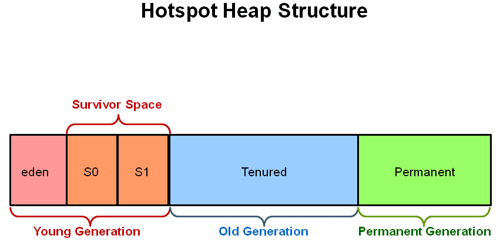

## How is virtual heap space divided in Java

When a Java program started Java Virtual Machine gets some memory from the Operating System. Java Virtual Machine or JVM uses this memory for all its needs and part of this memory is call java heap memory.

Heap in Java generally located at bottom of address space and move upwards. whenever we create an object using a new operator or by any other means the object is allocated memory from Heap and When object dies or garbage collected, memory goes back to Heap space in Java.

Java Heap space is divided into three regions or generation for sake of garbage collection called New Generation, Old or tenured Generation, or Perm Space. The permanent generation is garbage collected during full gc in hotspot JVM.

- Eden Space: The pool from which memory is initially allocated for most objects.

- Survivor Space: The pool containing objects that have survived the garbage collection of the Eden space.

- Tenured Generation or Old Gen: The pool containing objects that have existed for some time in the survivor space.

## Disadvantages of setting heap size too high

When running applications on small heaps (below 4GB) you often do not need to think about GC internals. But when increasing heap sizes to tens of gigabytes you should definitely be aware of the *potential stop-the-world pauses* induced by the full GC. The very same pauses did also exist with small heap sizes, but their length was significantly shorter – your pauses that now last for more than a minute might have originally spanned only a few hundred milliseconds.

## What are utilities for JVM monitoring? What is Jconsole?

The JConsole graphical user interface is a monitoring tool that complies to the Java Management Extensions (JMX) specification. JConsole uses the extensive instrumentation of the Java Virtual Machine (Java VM) to <u>provide information about the performance and resource consumption of applications running on the Java platform.</u>

## How to force GC be executed

Call `System.gc()` which simply is a hint to the garbage collector that you want it to do a collection. 

## Garbage collection principles

Automatic garbage collection is the process of looking at heap memory, identifying which objects are in use and which are not, and deleting the unused objects. An in use object, or a referenced object, means that some part of your program still maintains a pointer to that object. An unused object, or unreferenced object, is no longer referenced by any part of your program. So the memory used by an unreferenced object can be reclaimed.

In a programming language like C, allocating and deallocating memory is a manual process. In Java, process of deallocating memory is handled automatically by the garbage collector. The basic process can be described as follows.

## Are memory leaks a problem in Java?

A Memory Leak is a situation when there are objects present in the heap that are no longer used, but the garbage collector is unable to remove them from memory and, thus they are unnecessarily maintained.

A memory leak is bad because it blocks memory resources and degrades system performance over time. And if not dealt with, the application will eventually exhaust its resources, finally terminating with a fatal java.lang.OutOfMemoryError.

There are two different types of objects that reside in Heap memory — referenced and unreferenced. Referenced objects are those who have still active references within the application whereas unreferenced objects don't have any active references.

The garbage collector removes unreferenced objects periodically, but it never collects the objects that are still being referenced. This is where memory leaks can occur.
