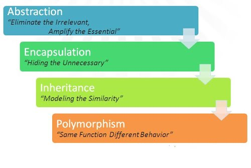

## Name OOP principles that you know

**Abstract** means a concept or an idea which is not associated with any particular instance. Using abstract class/interface we express the intent of the class rather than the actual implementation. In a way, one class should not know the inner details of another in order to use it, just knowing the interfaces should be good enough.

**Encapsulation** is the mechanism of hiding of data implementation by restricting access to public methods. Instance variables are kept private and accessor methods are made public to achieve this.

**Inheritances** expresses “**is-a**” and/or “**has-a**” relationship between two objects. Using Inheritance, in derived classes we can reuse the code of existing super classes. In Java, concept of “is-a” is based on class inheritance (using extends) or interface implementation (using implements). For example, *FileInputStream* "is-a" *InputStream* that reads from a file.

**Polymorphism** means one name many forms. It is further of two types — static and dynamic. Static polymorphism is achieved using method overloading and dynamic polymorphism using method overriding. It is closely related to inheritance. We can write a code that works on the superclass, and it will work with any subclass type as well.

## Inheritance vs Composition

When a child class inherits from a parent class, the child acquires all behaviors from the parent. Inheritance will make a class hierarchy — you can imagine it as a tree of classes.  
Composition is in contrast to inheritance, it enables the creation of complex types by combining objects (components) of other types, rather than inheriting from a base or parent class. To put it simply, composition contains instances of other classes that implement the desired functionality.  

Inheritance is known as the tightest form of coupling in object-oriented programming. Changing a base class can cause unwanted side effects on its subclasses or even all over the codebase.  
Composition is a far looser coupling. Combining with Dependency Injection (here), it brings more flexibility and also allows us to change runtime behavior.  
When building a class combining various components, it’s more natural to use composition than to try to find commonality between them and create a class tree.  
This approach accommodates future requirement changes, that may require a complete restructuring of the class tree in the inheritance approach, more easily. We can simply add a new component to the composited class rather than modifying the superclass to adapt changes.  
They’re different in purpose too:  
Inheritance: To design a class on what it is.  
Composition: To design a class on what it does.  
In most cases, composition can be used interchangeably with inheritance. One thing that makes inheritance so well-known is polymorphism.   Composition is initially not designed for polymorphism. But most programming languages allow us to do that with interfaces  
Sometimes, it’s true that we use inheritance inappropriately. The Liskov Substitution principle would be the most important guideline to determine whether inheritance fits your design or not.  
Use inheritance when you really need it, not just to reuse some code. When you’re considering using inheritance, ask yourself whether the subclass really is a more specialized version of the superclass, otherwise, some days you will experience a mess.

## Coupling & Cohesion 

**Coupling** refers to how related or dependent two classes/modules are toward each other. For low coupled classes, changing something major in one class should not affect the other. High coupling would make it difficult to change and maintain your code; since classes are closely knit together, making a change could require an entire system revamp.    
**Cohesion** refers to what the class (or module) can do. Low cohesion would mean that the class does a great variety of actions - it is broad, unfocused on what it should do. High cohesion means that the class is focused on what it should be doing, i.e. only methods relating to the intention of the class.

<u>Good software design has high cohesion and low coupling.</u>

## Difference between overriding and overloading

| No. | Method Overloading                       | Method Overriding                        |
|-----|------------------------------------------|------------------------------------------|
| 1)  | Method overloading is used <em>to increase the readability</em> of the program. | Method overriding is used <em>to provide the specific implementation</em> of the method that is already provided by its super class. |
| 2)  | Method overloading is performed <em>within class</em>. | Method overriding occurs <em>in two classes</em> that have IS-A (inheritance) relationship. |
| 3)  | In case of method overloading, <em>parameter must be different</em>. | In case of method overriding, <em>parameter must be same</em>. |
| 4)  | Method overloading is the example of <em>compile time polymorphism</em>. | Method overriding is the example of <em>run time polymorphism</em>. |
| 5)  | In java, method overloading can't be performed by changing return type of the method only. <em>Return type can be same or different</em> in method overloading. But you must have to change the parameter. | <em>Return type must be same or covariant</em> in method overriding. |

## How can we replace multi-inheritance pattern in Java

Multiple inheritance in Java programming is achieved or **implemented using interfaces**. Java does not support multiple inheritance using classes. “A class can extend only one class but it can implement multiple interfaces.”

## Can interface inherit from different interface

**Interfaces can inherit from one or more interfaces (<u>extends</u>)**. The derived interface inherits the members from its base interfaces. A class that implements a derived interface must implement all members in the derived interface, including all members of the derived interface's base interfaces.

## What is a marker interface

It is an *empty interface* (no field or methods). Examples of marker interface are Serializable, Clonnable and Remote interface. All these interfaces are empty interfaces.

