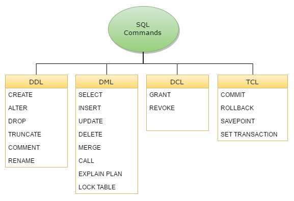
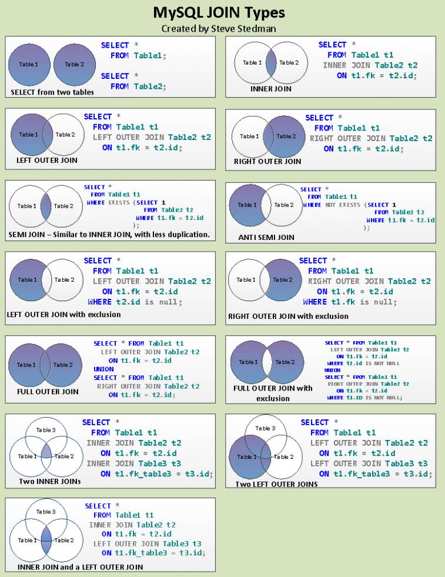

# DB INTRODUCTION

<u>**Obiectivul principal al sistemelor informatice**</u> îl constituie:
-	culegerea
-	stocarea
-	verificarea
-	transmiterea
-	prelucrarea   
	automată a datelor cu ajutorul mijloacelor electronice de calcul

    -	în scopul satisfacerii diferitelor niveluri de conducere cu informații necesare luării deciziilor
    -	în condiții de eficiență economică sporită

**O bază de date** 
-	este o colecție organizată de informație structurată care este în general păstrată și accesată electronic de pe un sistem informatic. 
-	ansamblu de colecții de date aflate in interdependență, împreună cu dicționarul de date care conține descrierea datelor și a legăturilor dintre ele (fapt ce asigură independență datelor față de  aplicații).

**Baza de date relațională** = reprezintă un ansamblu de relații (tabele) de date împreună cu legăturile dintre ele (<u>ansamblu de tabele normalizate</u>, grupate în jurul unui subiect, în principiu, bine definit)

**Sistemul de gestiune a unei baze de date (<u>database management system</u> - DBMS)** 
	componentă software care interacționează cu:
-	utilizatorii finali, 
-	aplicațiile,
-	baza de date 
    1.	pentru a furniza și analiza informațiile păstrate în baza de date. 
    2.	cuprinde funcționalități necesare administrării bazei de date. 
Împreună, baza de date, sistemul de gestiune și aplicațiile asociate, sunt referite ca sistem de bază de date.

-	componentă software cu rolul de a administra bazele de date și de a 
-	ascunde utilizatorilor detalii precum modul de stocare și de accesare a datelor într-o bază de date.
-	Interacționează cu toate componentele asigurând interfața dintre o bază de date și utilizatorii acesteia.
    -	definește structura bazei de date
    -	încarcă datele
    -	oferă acces la date (interogare, actualizare)
    -	întreținerea bazei de date (inclusiv refacerea în caz de incident)
    -	reorganizarea bazei de date (restructurare, modificarea strategiei de acces)
    -	oferă instrumente pentru asigurarea securității datelor

**Obiective SGBD:**
-	asigură facilități sporite de utilizare a datelor
-	asigură redundanță minimă și controlată a datelor
-	asigură independență datelor față de aplicații
-	sporește gradul de securitate a datelor împotriva accesului neautorizat
-	asigură integritatea datelor
-	asigură partajabilitatea datelor


<u>**Schema**</u> **este o colecție de obiecte ale bazei de date, care include structuri logice ca tabele, legături, viziuni, secvențe, proceduri stocate, sinonime, index-uri și clustere.**  
-	Un utilizator deține o schemă.
-	Utilizatorul și schema au același nume.
-	CREATE USER creează un utilizator, iar în același timp se creează și schema pt. acel utilizator
-	CREATE SCHEMA creză mai multe tabele și viziuni și execută comenzi de acordare drepturi pe schema proprie, într-o singură tranzacție.
-	Un utilizator poate accesa și obiecte din alte scheme dacă are drepturi.
-	Putem abstractiza ideea de schemă ca fiind directorul „home” al utilizatorului

Baza de date conține toți utilizatorii precum și datele lor (precum și utilizatori de sistem, tabele, viziuni, etc.) 

**Structura de date** = modalitate de stocare a informațiilor într-un sistem informatic a. î. acestea să poată fi utilizate în mod eficient.

**Dicționarul de date** (zonă separată a bazei de date):
-	conține informații despre baza de date
-	cuprinde structura de date
-	restricții de integritate
-	viziuni, clustere etc

**Modelul relațional** - componente:
-	structura relațională = tabele bidimensionale de date (relații). Asocierile dintre relații se reprezintă explicit prin atribute de legătură
-	operatori relaționali = operații care se pot efectua asupra relațiilor (interogare, adăugare, modificare, ștergere)
-	restricții de integritate = definirea stărilor coerente (structurale și de comportament)

**Depozit de date** = ansamblu de date de dimensiune foarte mare care este întreținut separat de bazele de date operaționale ale unei organizații și care este construit din date provenite din sisteme sursă prin extragere, filtrare, transformare și stocate în depozite speciale, în scopul sprijinirii proceselor decizionale și executive. 
-	dep. de date trebuie să asigure accesul la datele organizației cât mai rapid și un timp de răspuns cât mai mic al sistemului
-	utilizare datelor din depozite direct în analize, fără alte prelucrări suplimentare
-	stocarea de date istorice


<u>**Normalizare**</u>  
-	**FN1**. O tabelă este în FN1 dacă toate atributele ei conţin valori elementare (nedecompozabile), adică fiecare tuplu <u>nu trebuie să aibă date la *nivel de grup* sau *repetitiv*</u>. (nu putem avea câmpuri cu date compuse, gen șiruri de numere, sau mai multe valori într-un câmp) (de asemenea trebuie să eliminăm valori care se tot repetă (cu excepția unor chei externe))

-	**FN2**. O tabelă este în FN2 dacă şi numai dacă este în FN1 şi <u>fiecare atribut noncheie</u> al tabelei <u>este *dependent funcţional complet de cheie*</u>. (fără dependențe funcționale parțiale) (dependență parțială = există un atribut care depinde de doar una din chei (în caz că avem mai mult de una))

-	**FN3**. O tabelă este în FN3 dacă şi numai dacă este în FN2 şi <u>fiecare atribut noncheie depinde în mod *netranzitiv* de cheia</u> tabelei. (fără dependențe tranzitive) (există un atribut care depinde de un alt atribut care nu este cheie)

-	**BCNF** (Boyce Codd Normal Form): o tabelă este în BCNF dacă este în FN3 și fiecare determinant este un candidat cheie (<u>oricare din cheile tabelului nu este dependentă de valoarea unui atribut noncheie</u>). Determinantul este un atribut elementar sau compus faţă de care alte atribute sunt complet dependente funcţional.

-	**FN4**. O tabelă este în FN4 dacă şi numai dacă este în FN3 şi <u>nu conţine două sau mai multe *dependenţe multivaloare*</u>. (fără dependențe multivaloare)

-	**FN5**. O tabelă este în FN5 dacă şi numai dacă este în FN4 şi fiecare *dependenţă joncţiune* este generată printr-un candidat cheie al tabelei. (<u>fără dependențe joncțiune</u>)


<u>**Restricțiile de integritate**</u> (*structurale, comportamentale*)
- **NOT NULL** nu permite valori NULL în coloanele unei tabele; 
- **UNIQUE** nu sunt permise valori duplicat în coloanele unei tabele; 
- **PRIMARY KEY** nu permite valori duplicate sau NULL în coloana sau coloanele definite astfel; 
- **FOREIGN KEY** presupune ca fiecare valoare din coloana sau setul de coloane definit astfel să aibă o valoare corespondentă identică în tabela de legătură, tabelă în care coloana corespondentă este definită cu restricţia UNIQUE sau PRIMARY KEY; 
- **CHECK** elimină valorile care nu satisfac anumite cerinţe (condiţii) logice. (de comportament)


<u>**Reguli pentru restricții de integritate**</u>:
-	**entitate** – o <u>cheie primară</u> trebuie să fie unică și niciuna din părțile ei nu poate fi NULL
-	**referențială** – o <u>cheie de legătură</u> trebuie să aibă corespondență într-o cheie primară existentă (sau poate fi NULL dacă se permite)
-	**coloană** – trebuie să conțină date <u>definite de formatul</u> coloanei
-	**definită de utilizator** – trebuie să satisfacă <u>cerințe de business</u> (CHECK)


<u>**Instrucțiuni**</u>

-	**DDL (Data Definition Language)** - definire, întreţinere şi ştergere obiecte BD;
    - create
    - alter (used to add a new column, modify an existing column, define a DEFAULT value for a column, drop a column)
    - rename
    - drop
    - truncate
-	**DML (Data Manipulation Language)** - regăsire, inserare, actualizare, ştergere rânduri de date;  
    - select
    - insert
    - update
    - delete
-	**TCL (Transaction Control Language)** - controlul instrucţiunilor DML (COMMIT, ROLLBACK, SAVEPOINT etc);


O <u>**tranzacţie**</u> este o unitate logică de lucru care cuprinde <u>una sau mai multe instrucţiuni SQL</u> executate de către <u>un singur utilizator</u>. Tranzacţia începe cu prima instrucţiune SQL executabilă şi se termină în mod explicit cu *finalizarea* (<u>commit</u>) sau, după caz, *anularea tranzacţiei* (<u>rollback</u>).  
**Tabela sau relaţia** este un ansamblu format din n coloane (atribute/subansambluri) şi m rânduri (tupluri/linii) care respectă următoarele condiţii minime: 
-	<u>nu conţine date la nivel agregat</u> (valorile aflate la intersecţia liniilor cu coloanele să fie la un nivel elementar); 
-	<u>liniile sunt distincte unele faţă de altele</u>; 
-	<u>nu conţine coloane repetitive</u>;  

**Cheia primară** este un atribut care are valori distincte. Două sau mai multe atribute care pot fi chei primare se numesc **chei candidate**.   
**Coloana** tabelei este formată din valorile pe care le ia atributul în liniile tabelei respective.   
**Rândul/tuplul/linia** este format din valorile coloanelor ce se referă la o entitate a tabelei.   
**Viziunea** este o <u>tabela logică</u> şi reprezintă o fereastră la date, dintr-una sau mai multe tabele.   
**Sinonime** ale unor nume de tabele sau viziuni – folosite pentru realizarea unor operaţii sau pentru a utiliza în cereri nume mai scurte.
Un **index** reprezintă <u>o cheie pe una sau mai multe coloane</u> - pentru ca accesul la date sa se facă mai rapid. Indexarea este dinamică deoarece se pot adaugă sau şterge indecşi oricînd, fără ca datele memorate sau aplicaţiile scrise să fie afectate.   
Un **cluster** reprezintă o anumită modalitate de <u>grupare a rândurilor uneia sau mai multor tabele</u>. Această grupare măreşte viteza de execuţie a unor operaţii consumatoare de timp.

## **DDL (data definition language)**

```sql
CREATE TABLE example (
	ex_id	    NUMBER(6),
	ex_name     VARCHAR2(100),
	ex_date     DATE,
	CONSTRAINT ex_pk PRIMARY KEY (ex_id, ex_name) 
);


ALTER TABLE example
	ADD (
		ex_price	NUMBER(10, 3),
		ex_quantity	NUMBER(6)
		);


ALTER TABLE example
	ADD CONSTRAINT ex_q_ck CHECK (ex_quantity > 0);


ALTER TABLE example
	MODIFY (
		ex_quantity	NUMBER(10)
		);


ALTER TABLE example
    SET UNUSED (ex_quantity);


ALTER TABLE example
	DROP COLUMN ex_quantity;
	

DROP TABLE example;


-- sometimes we can recover a table from DB recycle bin:

FLASHBACK TABLE example TO BEFORE DROP;

-- to actually bypass recycle bin:

DROP TABLE example PURGE;


TRUNCATE TABLE example;
-- does not generate rollback information (as DELETE)

RENAME example TO examples;
```

## **DML (data manipulation language)**

```sql
INSERT INTO example (
		ex_id,
		ex_name 
	) VALUES (
		11,
		‚Popescu');
	
		
CREATE TABLE 
    copy_example AS (
	SELECT * FROM example);


UPDATE 
    example
SET 
    ex_name = ‚Ionescu'
WHERE 
    ex_id = 11;


DELETE FROM 
    example
WHERE 
    ex_id = 11;


CREATE VIEW name AS ...


CREATE SYNONYM name FOR example;
```

----------------------

## What are DML and DDL



**DDL** is short name of **Data Definition Language**, which deals with database schemas and descriptions, of how the data should reside in the database. <u>Defines data structures.</u>

**DML** is short name of **Data Manipulation Language** which deals with data manipulation and it is used to store, modify, retrieve, delete and update data in database. <u>Manipulate data itself.</u>

**DCL** is short name of **Data Control Language**, mostly concerned with rights, permissions and other controls of the database system.

**TCL** is short name of **Transaction Control Language** which deals with transaction within a database.

## Aggregate functions with examples

Aggregate functions return a single result row based on groups of rows, rather than on single rows. In a query containing a GROUP BY clause, the elements of the select list can be aggregate functions, GROUP BY expressions, constants, or expressions involving one of these. DBMS applies the aggregate functions to each group of rows and returns a single result row for each group.

```sql
SELECT AVG(MAX(salary))
  FROM employees
  GROUP BY department_id;
  
  -- This calculation evaluates the inner aggregate (MAX(salary)) 
  -- for each group defined by the GROUP BY clause (department_id), 
  -- and aggregates the results again.
```


## Constrint types

- NOT NULL
- UNIQUE
- PRIMARY KEY
- FOREIGN KEY
- CHECK

It is advisable to name the constraint:  
`CONSTRAINT clients_client_num_pk PRIMARY KEY (client_number)`

Example of a composite unique-key (at table level):  
`CONSTRAINT clients_phone_email_uk UNIQUE(email, phone)`


## Primary key vs unique key. Differences.

| PARAMENTER                               | PRIMARY KEY                              | UNIQUE KEY                               |
|------------------------------------------|------------------------------------------|------------------------------------------|
| Basic                                    | Used to serve as a unique identifier for each row in a table. | Uniquely determines a row which isn’t primary key. |
| NULL value acceptance                    | Cannot accept NULL values.               | Can accept <u>one</u> NULL value.               |
| Number of keys that can be defined in the table | Only one primary key                     | More than one unique key                 |
| Index                                    | Creates clustered index                  | Creates non-clustered index              |

Both can be referenced by foreign key of another table.

## What are transactions?. ACID?

A transaction is a unit of work that is performed against a database. Transactions are units or sequences of work accomplished in a logical order, whether in a manual fashion by a user or automatically by some sort of a database program.

A transaction is the propagation of one or more changes to the database. For example, if you are creating a record or updating a record or deleting a record from the table, then you are performing a transaction on that table. It is important to control these transactions to ensure the data integrity and to handle database errors.

Practically, you will club many SQL queries into a group and you will execute all of them together as a part of a transaction.

<u>Transactions have the following four standard properties</u>, usually referred to by the acronym **ACID**:

- **Atomicity** − ensures that all operations within the work unit are completed successfully. Otherwise, the transaction is aborted at the point of failure and all the previous operations are rolled back to their former state.

- **Consistency** − ensures that the database properly changes states upon a successfully committed transaction.

- **Isolation** − enables transactions to operate independently of and transparent to each other.

- **Durability** − ensures that the result or effect of a committed transaction persists in case of a system failure.

## What is a view/materialized view. Why they are needed?

**Views** are a logical virtual table created by “select query” but the result is not stored anywhere in the disk and every time we need to fire the query when we need data, so always we get updated or latest data from original tables.

**Materialized views** are also the logical view of our data-driven by the select query but the result of the query will get stored in the table or disk, also the definition of the query will also store in the database. Another difference between View vs materialized view is that, when we create a view using any table, rowid of view is same as the original table but in case of Materialized view rowid is different. One more difference between View and materialized view in the database is that In case of View we always get latest data but in case of Materialized view we need to refresh the view for getting latest data. Last difference between View vs Materialized View is that In case of Materialized view we need an extra trigger or some automatic method so that we can keep MV refreshed, this is not required for views in the database. Materialized views are used mostly with data warehousing or business intelligence application.

Views have the following benefits:
- **Security** - Views can be made accessible to users while the underlying tables are not directly accessible. This allows the DBA to give users only the data they need, while protecting other data in the same table.
- **Simplicity** - Views can be used to hide and reuse complex queries.
- **Column Name Simplication or Clarification** - Views can be used to provide aliases on column names to make them more memorable and/or meaningful.
- **Stepping Stone** - Views can provide a stepping stone in a "multi-level" query. For example, you could create a view of a query that counted the number of sales each salesperson had made. You could then query that view to group the sales people by the number of sales they had made.

## What types of constraints does one know?

SQL constraints are used to specify rules for the data in a table.

- **NOT NULL** - Ensures that a column cannot have a NULL value
- **UNIQUE** - Ensures that all values in a column are different
- **PRIMARY KEY** - A combination of a NOT NULL and UNIQUE. Uniquely identifies each row in a table
- **FOREIGN KEY** - Uniquely identifies a row/record in another table
- **CHECK** - Ensures that all values in a column satisfies a specific condition
- **DEFAULT** - Sets a default value for a column when no value is specified
- **INDEX** - Used to create and retrieve data from the database very quickly

## What are ways to increase performance of database

**Optimize the logical design**  
The logical level is about the structure of the query and tables themselves. The goal is to access as few data as possible at the logical level.
- Have the most efficient SQL queries
- Design a logical schema that support the application's need (e.g. type of the columns, etc.)
- Design trade-off to support some use case better than other
- Relational constraints
- Normalization

**Optimize the physical design**  
The physical level deals with non-logical consideration, such as type of indexes, parameters of the tables, etc. Goal is to optimize the IO which is always the bottleneck. Tune each table to fit it's need. Small table can be loaded permanently loaded in the DBMS cache, table with low write rate can have different settings than table with high update rate to take less disk spaces, etc. Depending on the queries, different index can be used, etc. You can denormalized data transparently with materialized views, etc.
- Tables parameters (allocation size, etc.)
- Indexes (combined, types, etc.)
- System-wide parameters (cache size, etc.)
- Partitioning
- Denormalization

**Optimize the maintenance**  
Database must be operated correctly to stay as efficient as possible. This include a few mainteanance taks that can have impact on the perofrmance, e.g.
- Keep statistics up to date
- Re-sequence critical tables periodically
- Disk maintenance
- All the system stuff to have a server that rocks

## What is the role of indexes?

Indexes are special lookup tables that the database search engine can use to speed up data retrieval. Simply put, an index is a pointer to data in a table. An index in a database is very similar to an index in the back of a book.

```sql
-- single-column indexes:
CREATE INDEX index_name
on table_name (column_name);

-- composite indexes:
CREATE INDEX index_name
on table_name (column1, column2);
```

## What kind of joins do you know?

There are four basic types of SQL joins: inner, left, right, and full.



## What transaction isolation levels do you know?

As we know that, in order to maintain consistency in a database, it follows ACID properties. Among these four properties (Atomicity, Consistency, Isolation and Durability) <u>Isolation determines how transaction integrity is visible to other users and systems</u>. It means that a transaction should take place in a system in such a way that it is the only transaction that is accessing the resources in a database system.  
Isolation levels define the degree to which a transaction must be isolated from the data modifications made by any other transaction in the database system.

A transaction isolation level is defined by the following phenomena:
- *Dirty Read* – A Dirty read is the situation when a transaction reads a data that has not yet been committed. For example, Let’s say transaction 1 updates a row and leaves it uncommitted, meanwhile, Transaction 2 reads the updated row. If transaction 1 rolls back the change, transaction 2 will have read data that is considered never to have existed.
- *Non Repeatable read* – Non Repeatable read occurs when a transaction reads same row twice, and get a different value each time. For example, suppose transaction T1 reads data. Due to concurrency, another transaction T2 updates the same data and commit, Now if transaction T1 rereads the same data, it will retrieve a different value.
- *Phantom Read* – Phantom Read occurs when two same queries are executed, but the rows retrieved by the two, are different. For example, suppose transaction T1 retrieves a set of rows that satisfy some search criteria. Now, Transaction T2 generates some new rows that match the search criteria for transaction T1. If transaction T1 re-executes the statement that reads the rows, it gets a different set of rows this time.

The SQL standard defines four isolation levels:  
- **Read Uncommitted** – Read Uncommitted is the lowest isolation level. In this level, one transaction may read not yet committed changes made by other transaction, thereby allowing dirty reads. In this level, transactions are not isolated from each other.
- **Read Committed** – This isolation level guarantees that any data read is committed at the moment it is read. Thus it does not allows dirty read. The transaction holds a read or write lock on the current row, and thus prevent other transactions from reading, updating or deleting it.
- **Repeatable Read** – This is the most restrictive isolation level. The transaction holds read locks on all rows it references and writes locks on all rows it inserts, updates, or deletes. Since other transaction cannot read, update or delete these rows, consequently it avoids non-repeatable read.
- **Serializabl**e – This is the Highest isolation level. A serializable execution is guaranteed to be serializable. Serializable execution is defined to be an execution of operations in which concurrently executing transactions appears to be serially executing.


## Which of SELECT, UPDATE, DELETE, ADD’s performance is mostly affected by performance of indexes?

If you insert into or delete from a table, the system has to insert or delete rows in all the indexes on the table. If you update a table, the system has to maintain those indexes that are on the columns being updated. So having a lot of indexes can speed up select statements, but slow down inserts, updates, and deletes.

Note: Updates and deletes with WHERE clauses can use indexes for scans, even if the indexed column is being updated.

## What are normal forms?

**Normalization** is the process of minimizing redundancy from a relation or set of relations. <u>Redundancy in relation may cause insertion, deletion and updation anomalies.</u>

## What does it mean database de-normalization?

**Denormalization** is a database optimization technique in which we add redundant data to one or more tables. This can help us avoid costly joins in a relational database.

**Pros of Denormalization:**
- Retrieving data is faster since we do fewer joins
- Queries to retrieve can be simpler(and therefore less likely to have bugs), since we need to look at fewer tables.

**Cons of Denormalization:**
- Updates and inserts are more expensive.
- Denormalization can make update and insert code harder to write.
- Data may be inconsistent . Which is the “correct” value for a piece of data?
- Data redundancy necessitates more storage.

In a system that demands scalability, like that of any major tech companies, we almost always use elements of both normalized and denormalized databases.