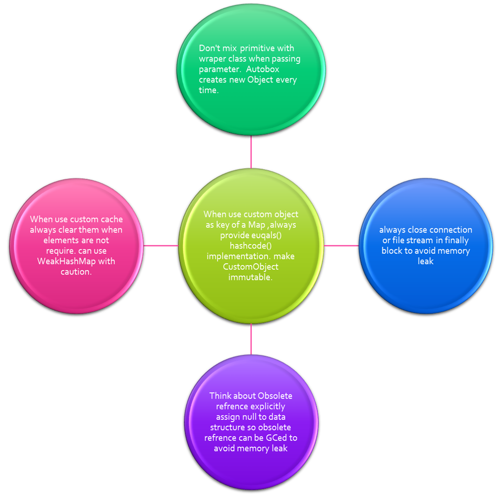

# Memory Leaks and Java Code

Java implicitly reclaims memory by GC (a daemon thread). GC periodically
checks if there is any object which is unreachable or, to be precise,
has no reference pointing to that object. If so, GC reclaims the
newly-available memory.

Now the question is should we worry about memory leaks or how Java
handles it?

Pay attention to the definition: ***An object is eligible for garbage
collection when it is unreachable (unused), and no living thread can
reach it.***

So if an object which is not used in an application but unintentionally
has references, it is not eligible for garbage collection, and is a
potential memory leak.

GC takes care of unreachable objects, but can’t determine unused
objects. Unused objects depend on application logic, so a programmer
must pay attention to the business code. Silly mistakes silently grow up
to be a monster.

Memory leaks can occur in many ways, I will look at some examples.

**Example 1**: **Autoboxing** 
-----------------------------

    package com.example.memoryleak;

    public class Adder {

           public long addIncremental(long l) {
                  Long sum = 0L;
                   sum = sum + l;
                   return sum;
           }


           public static void main(String[] args) {

                  Adder adder = new Adder();
                  
                  for(long i = 0; i < 1000; i++) {
                     adder.addIncremental(i);
                  }
           }
    }

Can you spot the memory leak?

Here I made a mistake. Instead of taking the primitive long for the sum,
I took the Long (wrapper class), which is the cause of the memory leak.
Due to auto-boxing, `sum=sum+l;` creates a new object in every
iteration, so 1000 unnecessary objects will be created. Please avoid
mixing and matching between primitive and wrapper classes. Try to use
primitive as much as you can.

**Example 2: Using Cache** 
--------------------------

   ```java
package com.example.memoryleak;

import java.util.HashMap;
import java.util.Map;

public class Cache {

       private Map<String,String> map= new HashMap<String,String>();
       
       public void initCache() {
              map.put("Anil", "Work as Engineer");
              map.put("Shamik", "Work as Java Engineer");
              map.put("Ram", "Work as Doctor");
       }
       
       public Map<String,String> getCache() {
              return map;
       }
       
       public void forEachDisplay() {
              for(String key : map.keySet()) {
                String val = map.get(key);                 
                System.out.println(key + " :: "+ val);
              }
       }
       
       
       public static void main(String[] args) {      
       
              Cache cache = new Cache();
              cache.initCache();
              cache.forEachDisplay();
       }
}
```


Here, a memory leak occurs due to the internal map data structure. This
class is to display the employee value from the cache. Once those are
displayed, there is no need to store those elements in the cache.

We forgot to clear the cache, so although objects in cache are not
required anymore by the application, it can’t be GCed, as map holds a
strong reference to them.

So when you're using your own Cache, don’t forget to clear them if items
in the cache are no longer required. Alternatively, you can initialize
cache by WeakHashMap. The beauty of WeakHashMap is, if keys are not
referenced by any other objects, then that entry will be eligible for
GC.

There is lot to say about WeakHashMap, but I will discuss it in another
article. Use it with caution, if you want to reuse the values stored in
the cache, it may be that its key is not referenced by any other object,
so the entry will be GCed and that value magically disappears.

**Example 3: Closing Connections** 
----------------------------------

    try {

      Connection con = DriverManager.getConnection();

      …………………..

      con.close();
      
    } catch(exception ex) {

    }

In the above example, we close the connection (Costly) resource in the
try block, so in the case of an exception, the connection will not be
closed. So it creates a memory leak as this connection never return back
to the pool.

Please always put any closing stuff in the finally block.

**Example 4: Using CustomKey** 
------------------------------

```java
package com.example.memoryleak;
import java.util.HashMap;
import java.util.Map;

public class CustomKey {

    private String name;

    public CustomKey(String name) {
        this.name = name;
    }
       
    public static void main(String[] args) {
         Map<CustomKey, String> map = new HashMap<CustomKey, String>();
         map.put(new CustomKey("Shamik"), "Shamik Mitra");
         String val = map.get(new CustomKey("Shamik"));
         System.out.println("Missing equals and hascode so value is not accessible from Map " + val);
    }
}
```

As in `CustomKey` we forgot to provide `equals()` and `hashcode()`
implementation, so a key and value stored in map can’t be retrieved
later, as the map get() method checks hashcode() and equals(). But this
entry is not able to be GCed, as the map has a reference to it, but
application can’t access it. Definitely a memory leak.

So when you make your Custom key, always provide an equals() and
hashcode() implementation.

**Example 5**: **Mutable Custom Key**
-------------------------------------

```java
package com.example.memoryleak;
import java.util.HashMap;
import java.util.Map;

public class MutableCustomKey {

    private String name;
    
    public MutableCustomKey(String name) {
        this.name = name;
    }
    
    public String getName() {
        return name;
    }
    
    publicvoid setName(String name) {
        this.name = name;
    }
    
    @Override
    public int hashCode() {
        final int prime = 31;
        int result = 1;
        result = prime * result + ((name == null) ? 0 : name.hashCode());
        return result;
    }
    
    @Override
    public boolean equals(Object obj) {
        if (this == obj)
               return true;
        if (obj == null)
               return false;
        if (getClass() != obj.getClass())
               return false;
               
        MutableCustomKey other = (MutableCustomKey) obj;
        
        if (name == null) {
            if (other.name != null)
                  return  false;
        } elseif (!name.equals(other.name))
            return false;
            
        return true;
    }
    
    
    public static void main(String[] args) {
    
        MutableCustomKey key = new MutableCustomKey("Shamik");          
        
        Map<MutableCustomKey, String> map = new HashMap<MutableCustomKey, String>();
        
        map.put(key, "Shamik Mitra");
        
        MutableCustomKey refKey = new MutableCustomKey("Shamik");
        String val = map.get(refKey);
        
        System.out.println("Value Found " + val);
        key.setName("Bubun");
        
        String val1 = map.get(refKey);
        
        System.out.println("Due to MutableKey value not found " + val1);
    }
}
```

Although here we provided equals() and hashcode() for the custom Key, we
made it mutable unintentionally after storing it into the map. If its
property is changed, then that entry will never be found by the
application, but map holds a reference, so a memory leak happens.

Always make your custom key immutable.

**Example 6: Internal Data Structure** 
--------------------------------------

```java
package com.example.memoryleak;

public class Stack {

    private int maxSize;
    private int[] stackArray;
    private int pointer;
    
    public Stack(int s) {
           maxSize = s;
           stackArray = newint[maxSize];
           pointer = -1;
    }
    
    public void push(int j) {
           stackArray[++pointer] = j;
    }
    
    public int pop() {
           return stackArray[pointer--];
    }
    
    public int peek() {
           return stackArray[pointer];
    }
    
    public boolean isEmpty() {
           return (pointer == -1);
    }
    
    public boolean isFull() {
           return (pointer == maxSize - 1);
    }
    
    
    public static void main(String[] args) {
        Stack stack = new Stack(1000);
        
        for(int i = 0; i < 1000; i++) {
               stack.push(i);
        }
        
        for(int i = 0; i < 1000; i++) {
            int element = stack.pop();
            System.out.println("Poped element is "+ element);
        }
    }
}
```


Here we face a tricky problem when Stack first grows then shrinks.
Actually, it is due to the internal implementation. Stack internally
holds an array, but from an application perspective, the active portion
of Stack is where the pointer is pointing.

So when Stack grows to 1000, internally the array cells are filled up
with elements, but afterwards when we pop all elements, the pointer
comes to zero, so according to the application it is empty, but the
internal array contains all popped references. In Java, we call it
an **obsolete reference. An obsolete reference is a reference which
can’t be dereferenced.**

This reference can’t be GCed, as the array holds those elements, but
they are unnecessary after they are popped.

To fix it, we need to set the null value when the pop action occurs so
those objects are able to be GCed.

    public int pop() {

                  int size = pointer--
                  int element= stackArray[size];
                  stackArray[size];
                  return element;
           }

#### **Safety Measure for Preventing Memory Leaks:** {pid="48"}




[Link to article](https://dzone.com/articles/memory-leak-andjava-code?fromrel=true#)
