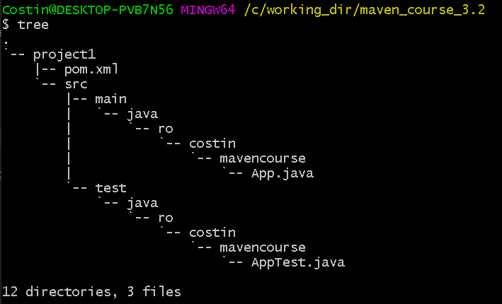
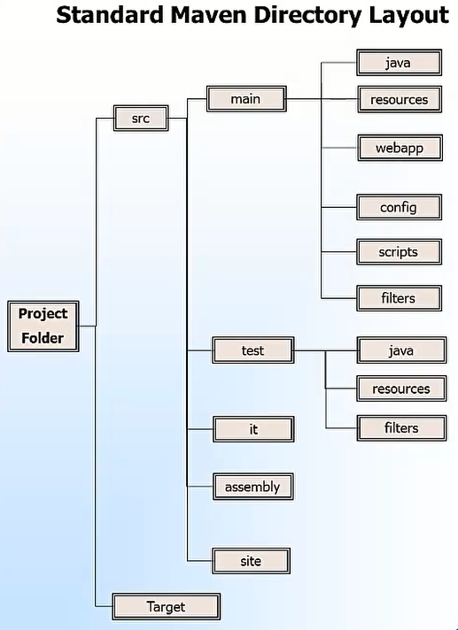
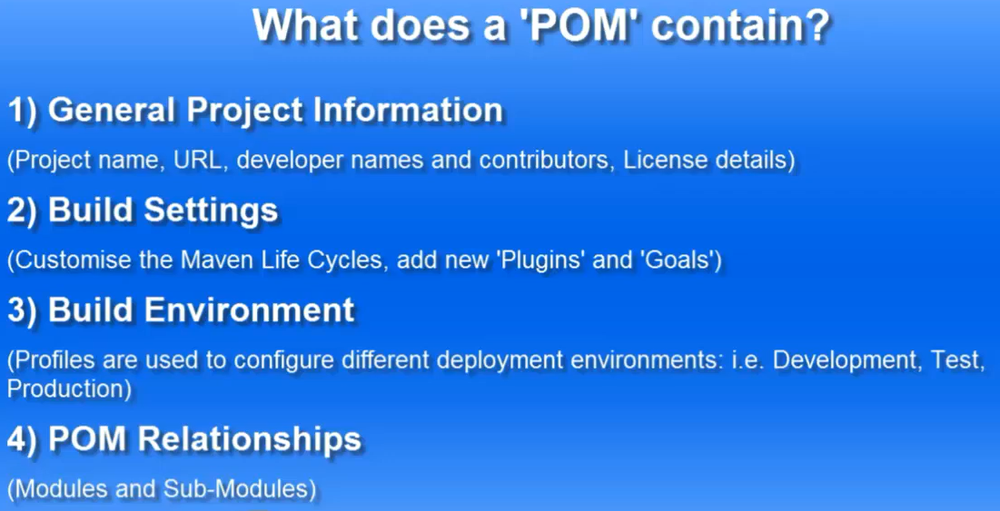
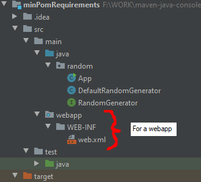
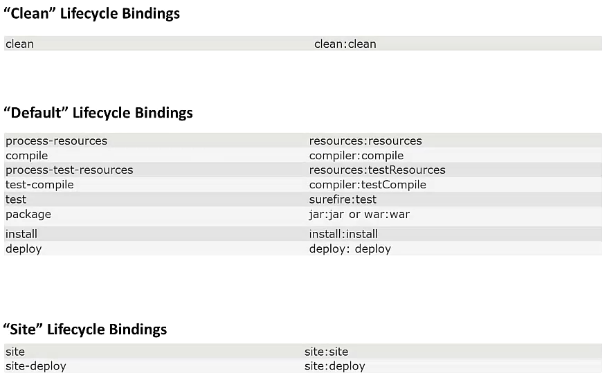
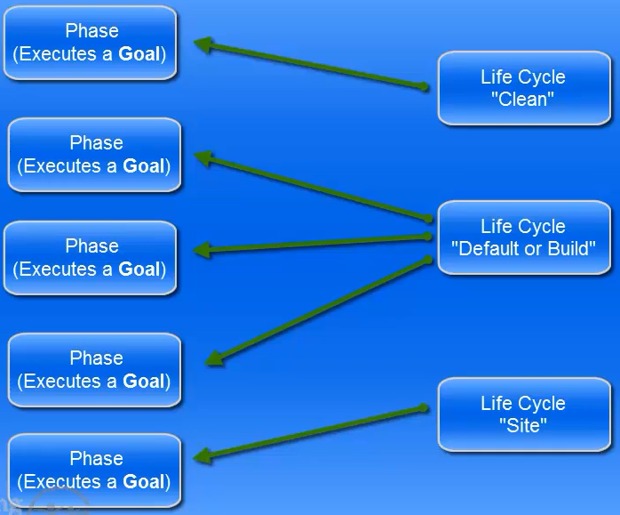
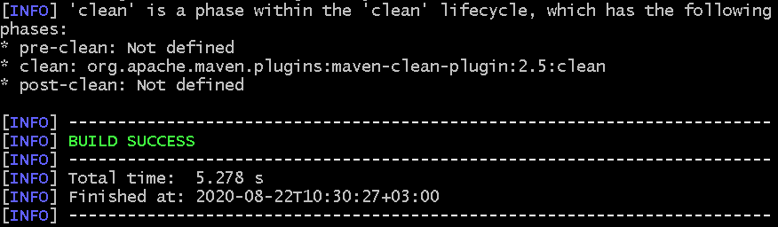
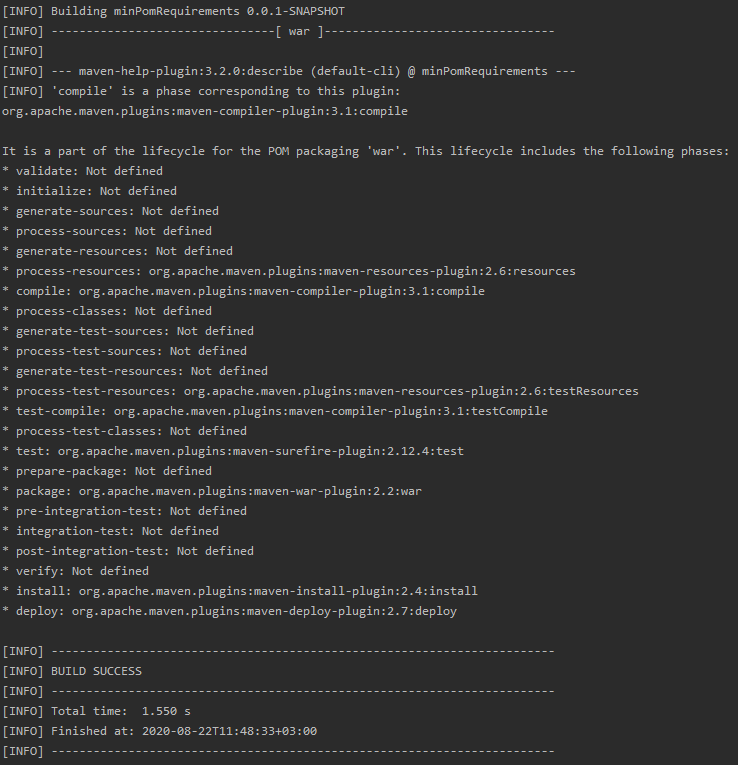
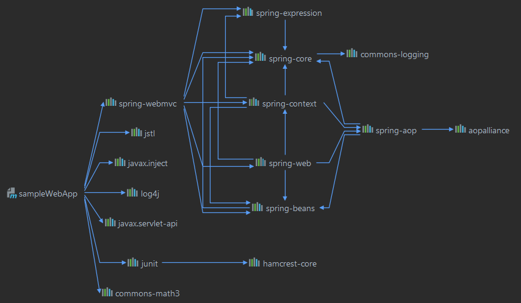
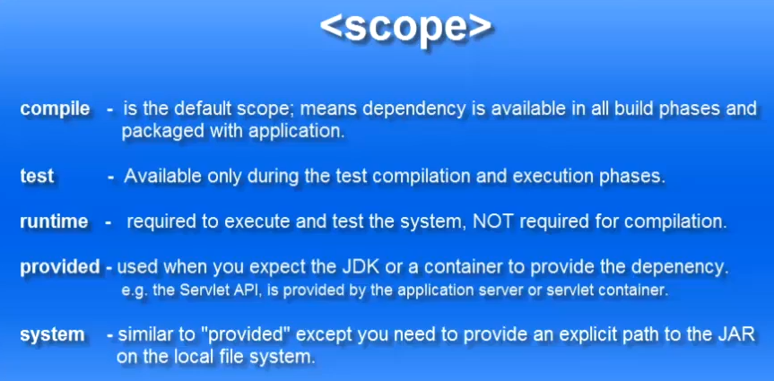

# MAVEN

- build tool
- dependency management

- projects described by a **POM (Project Object Model)** stored in XML format

- build life cycle - made in phases

- lists dependencies
- unit test reports, including coverage
- integration test reports

- Maven is a collection of plugins (jar files) downloaded when needed from a cental repository to a local cache

### TERMIONOLOGY

- **ARCHETYPES** = templates -> convenient way to generate a new project
- **SNAPSHOT** = jar, war files are subjected to changes
- **MAVEN COORDINATE** = GroupId + ArtifactId + Version  
     - groupId = name of the group fo project (ex. ro.costin)
     - artifactId = name of the project (ex. mavenproject)
     - version = project's version. Keeping SNAPSHOT in name means it is not for release yet
     - package = java package name

### COMMAND LINE GENERATION OF A PROJECT

QUICKSTART ARCHETYPE = creates a standard Maven Project



### STANDARD MAVEN DIRECTORY STRUCTURE



- src = source code  
- Target = contains artefacts generated by the build process (compiled sources, generated files)  
- test = unit tests
- it = integration tests

### POM (Project Object Model)



- pom.xml from the project inherits from a *super pom* (default configuration file) and even if we have an empty project we can still compile and build it
- pom + super pom = effective pom

### PACKAGING

- produces jar (default), war etc

- example packaging for creating a war file (web app) instead of a default jar:  
  - `<packaging>war</packaging>`
  
  - but we also need to configure the maven-war-plugin:
  
```xml
<packaging>war</packaging>

  <properties>
    <project.build.sourceEncoding>UTF-8</project.build.sourceEncoding>
    <project.reporting.outputEncoding>UTF-8</project.reporting.outputEncoding>
  </properties>

  <build>
    <plugins>
      <plugin>
        <groupId>org.apache.maven.plugins</groupId>
        <artifactId>maven-war-plugin</artifactId>
        <version>3.3.1</version>
        <configuration>
          <webXml>src\main\webapp\WEB-INF\web.xml</webXml>
        </configuration>
      </plugin>
    </plugins>
  </build>
```

and a certain project structure:  



- in the above syntax we are giving details about war plugin version and the location of web.xml (configuration for our web app). Also we are defining a UTF-8 encoding for the project (to correct an error from the build phase)
- after that, Maven will create a war artefact in the *Target* folder
 
### LIFECYCLES

- CLEAN = everything in the Target folder is deleted (this can be customized)
- DEFAULT = BUILD = handles building and deployment
- SITE = creation of the project "site" documentation  
A build phase represents a stage in that particular lifecycle and the phase has a responsability to execute a goal:  





As an example we can assign the clean phase a plugin (*help*, with the goal *describe*): 
`mvn help:describe -Dcmd=clean`



#### Execute goals

In IntelliJ - use *Execute Maven Goal* from Maven menu with the command `mvn help:describe -Dcmd=compile` . In this particular case we are invoking the help plugin with the describe goal. All will happen in compile (default) phase.



In the phase *Compile* we have a goal of compiling the plugin. The process (default phase) has 23 phases. Some have a bounded goal, some don't have any goal defined. To compile we can use maven compiler plugin with the `mvn compiler:compile`. If we get an error like: *Failed to execute goal org.apache.maven.plugins:maven-compiler-plugin:3.1:compile (default-cli) on project ... : Compilation failure* we can set compiler plugin in pom.xml:

```xml
<build>
    <plugins>
        <plugin>
        <groupId>org.apache.maven.plugins</groupId>
        <artifactId>maven-compiler-plugin</artifactId>
        <version>3.8.1</version>
        <configuration>
          <source>11</source>
          <target>11</target>
        </configuration>
      </plugin>
    </plugins>
</build>
```
In this case, because we are running just the goal (compile) and not the whole compile phase, only this goal will run. Also we can run more than one goal (concatenation) (all phases:goals will be written one after another separated by space).
Ex: `mvn clean:clean compiler:compile compiler:testCompile javadoc:javadoc surefire:test`

#### Execute Phases

Example:   
`clean test` = will run the clean, resources, compile, resources for the test, compile tests, run tests. <u>Clean phase will not run if not specified because it resides in a different lifecycle (clean lifecycle)</u> than test (which belongs to default lifecycle).  So that will run every phase in the default order until (and including) test phase (with the test goal).  
`clean install` = will run same phases and also package (jar or war) and install in the local repository (User_dir\.m2\repository).  

#### Customising Lifecycles

```xml
          <source>11</source>
          <target>11</target>
```

For the compiler-plugin:
- <source> tells which version of the JRE is compatible with this plugin
- <target> tells which version of the JRE will be compatible with the bytecode

**Assembly plugin** - we want to build a distribution which will contain all the dependencies within the project. The main goal in the assembly plugin is the single goal. It is used to create all assemblies.
```xml
    <plugin>
        <artifactId>maven-assembly-plugin</artifactId>
        <version>3.3.0</version>
        <configuration>
          <archive>
            <manifest>
              <mainClass>random.App</mainClass>
            </manifest>
          </archive>
          <descriptorRefs>
            <descriptorRef>jar-with-dependencies</descriptorRef>
          </descriptorRefs>
        </configuration>
    </plugin>
```

After, we want to set <packaging>jar</packaging>. Using "single" goal of the *assembly plugin* we can package into our jar, all of dependencies, the resulting target being 2 jar files, one with dependecies and other without:  
`mvn clean package assembly:single`

We can run the jar file from command line by getting to the file location (or including relative path) and:  
`java -jar minPomRequirements-0.0.1-SNAPSHOT-jar-with-dependencies.jar`

After configuration tag we can insert:

```xml
<executions>
  <execution>
    <id>create-executable-jar</id>
    <phase>package</phase>
    <goals>
      <goal>single</goal>
    </goals>
  </execution>
</executions>
```

to create an executable jar in the package phase within the single goal. Also we can move the whole configuration tag to be in local scope of the execution.

To show the EFFECTIVE POM of the project, right click on project name >> Maven... >> Show Effective POM.

When Maven packages the project it creates 2 jars (one with dependencies and one without). We can eliminate the jar without dependencies by copiing from the effective pom the plugin section for maven-jar-plugin into the pom.xml. After that, we will remove the goals and set phase value to "none".

```xml
    <plugin>
        <artifactId>maven-jar-plugin</artifactId>
        <version>2.4</version>
        <executions>
          <execution>
            <id>default-jar</id>
            <phase>package</phase>
            <goals>
              <goal>jar</goal>
            </goals>
          </execution>
        </executions>
    </plugin>
```

#### Maven Dependencies

For webapps we need to configure a Tomcat Server from `Edit Configurations` (Run/Debug Configurations) then `+` (add). If we get *The origin server did not find a current representation for the target resource or is not willing to disclose that one exists* error we need to go to `Deployment tab in Run/Debug Configurations` and add an Artifact. The page will be loaded in the default browser.

Every time we make a new change we need to repackage project: `mvn clean package` to see the changes in opur browser.

Transitive dependenies = some of our main dependecies need other dependencies. So there is a dependency hierarchy.



Example of a dependency element:

```xml
<dependency>
    <groupId>org.springframework</groupId>
    <artifactId>spring-webmvc</artifactId>
    <version>${spring.version}</version>
</dependency>
```

Scopes for dependencies:



Compile scope is the default scope. We don't need to set it to a dependency. For example test scope will not be packaged and deployed with our war file.

Provided scope means we need that dependency only at compile time (but not at run time - because our Tomcat server will provide it). 

We also have an optional scope `<optional>true</optional>`.

#### Troubleshooting

Errors that come when reading from the local Maven repo:  
`C:\Users\Username\.m2\repository` is the location of the local Maven repository. Sometimes it could get corrupted.

To resove this problem, we  could delete the repository folder. When we will try to package our project again, Maven will download all our dependencies from Maven Central.

#### Command Line

Open the project's folder in command prompt.

`mvn clean install` = install to LOCAL Maven repository  

To start up Tomcat from cmd:  
`"%CATALINA_HOME%/bin/startup.bat"`  
All .war files deployed in the webapps folder of Tomcat folder will be accessible from the browser.

