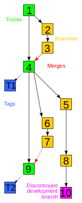

# VERSION CONTROL (GIT)



### 3 STAGES OF A FILE:
**I ) COMMITED** – data is stored in local database  
**II ) MODIFIED** – when file contents is changed  
**III ) STAGED** – changes are made and about to be commited  

### 3 STAGES OF A GIT PROJECT:

**I ) WORKING DIRECTORY**  
Single copy (checkout) of a version of the project. Files are pulled from GIT database.
Files that are not yet been added to the stage area for commit.

**II ) STAGING AREA (INDEX)**  
Area that sits between working and .git directory. Used for changes so when commit, then only files from the staging area are commited.
Files modified and added to be commited in the next snapshot.

**III ) .GIT DIRECTORY (REPOSITORY)**  
Files in GIT database.
Files recorded as version snapshot.

### CONFIGURATIONS 

3 levels of configuration:  
--local  
--global  
--system  

`cat ~/.gitconfig` = to view configuration file (global)  
`cat .git/config` = to view local config (good for viewing or editing remote(s))  
`code ~/.gitconfig` = to edit config file (or `vi ~/.gitconfig` to open with Vim (I for insertion :WQ for save & exit))  

`git config --global user.name "Darth Vader"` = to set a user name (global level)  
`git config --global` = to view user name set at the global level  
`git config --global user.email "dv@sw.com"` = to set global email  
`git config --global core.autocrlf true` = Configure Git on Windows to properly handle line endings  
`git config –list` = check out git configuration (`git config --global core.autocrlf input` (for Mac & Linux))   

#### ALIAS
`git config --global alias.s "status -s"` = setting an alias (silent status)  
`git config --global alias.lg "log --oneline --all --graph --decorate"` == setting an alias for a custom log command  
`git config --global alias.aa "add ."` == setting an alias for adding all  

### COMMANDS

`pwd` = print working directory
`touch filename.ext` = creates a file called filename.ext  
`cd` = change directory  
`cd ..` = up to main  
`cd \` = change to Home directory (in Windows C:\Users\CurrentUser)  
`cd \` = change to base directory (in Windows Git Bash directory)  
`dir` = list files (for Linux: ls)  
`copy con` = new empty file (for Linux: touch)  
`mkdir` = new empty folder  
`mv` = move or rename file  
`clear` = clear screen  
`man git` = git manual  
`git help <instruction>` = get help for a specific instruction    

### OPTIONS FOR REPO

Options for creating the repository:  
- `add.gitignore` = git will ignore all files with listed extensions that are in the repository (usually large files, or project configurations files). Extensions will be written in the .gitignore file.  
- Adding a licence (licence files).  
- Initialise repository with a readme.me file  
`echo <github_repo_name> >> README.md` = to add the README to the project  

**The rules for the patterns you can put in the .gitignore file are as follows:**
- Blank lines or lines starting with # are ignored.
- Standard glob patterns work, and will be applied recursively throughout the entire working tree.
- You can start patterns with a forward slash (/) to avoid recursivity.
- You can end patterns with a forward slash (/) to specify a directory.
- You can negate a pattern by starting it with an exclamation point (!).

**Glob patterns are like simplified regular expressions that shells use:**
- An asterisk (*) matches zero or more characters; 
- [abc] matches any character inside the brackets (in this case a, b, or c); 
- a question mark (?) matches a single character; 
- brackets enclosing characters separated by a hyphen ([0-9]) matches any character between them (in this case 0 through 9). 
- You can also use two asterisks to match nested directories; a/**/z would match a/z, a/b/z, a/b/c/z, and so on.

**Example .gitignore file:**
```
# ignore all .a files
*.a

# but do track lib.a, even though you're ignoring .a files above
!lib.a

# only ignore the TODO file in the current directory, not subdir/TODO
/TODO

# ignore all files in any directory named build
build/

# ignore doc/notes.txt, but not doc/server/arch.txt
doc/*.txt

# ignore all .pdf files in the doc/ directory and any of its subdirectories
doc/**/*.pdf
``` 

### INITIALISING, ADDING, COMMITING (ON LOCAL)

`git init` = a new repository is initialised in the current directory  
`git init <SomeFolderName>` = a new repository is initialised in the SomeFolderName folder (which will be created)  

`git clone <link>` = clone an online repository on a local drive.   
Links from github can be pasted with shift+insert (in the linux command line) 

### ADDING (TO STAGE)

`git add <filename>` = add a file to staging area (ready for commit)  
`git add.` = add files to the staging area (alternative: `git add -A`)   

`git rm --cached -r <filename>` = recursively remove a file from the repository  

`git restore --staged <file names>` = remove files from the staging area (unstage files)

### COMMITS

> *A 'commit' or 'revision' (SVN) is a modification that is applied to the repository. To commit (check in, ci or, more rarely, install, submit or record) is to write or merge the changes made in the working copy back to the repository. A commit contains metadata, typically the author information and a commit message that describes the change.*

`git commit -m` “here description or/and name of the commit is written” = commits and posts a message for the commit  

`git commit -a` = automatically commits changes to files tracked by git (`git commit -a -m "<message>"` = auto commit modified files and save a message for the commit (skip the staging area))  

`git commit --amend` = overwrites last commit (only works with last commit) with changes made now (add new changes to the previous commit) (also for modifying last commit's message)  
`git commit --amend --no-edit` = overwrites last commit with changes made now without editing previous commit message  

### GETTING BACK

`git checkout <short hash for the searched commit>` = to view state for a certain older commit. (detached HEAD state). To get back to the current tip of the branch: (`git checkout master`) (that is, if we are working on the master branch)  
`git restore --source=HEAD~1 --<path/filename>` = restore a file from a previous commit. The file will be recovered from the repo and put in the working directory  
`git restore --source=<other_branch> --<path/filename>` = restore a file from another branch. The file will be recovered from the repo and put in the working directory  
`git bisect start` = for finding bad commits (that introduced bugs). `git bisect good <short hash of an older commit>`

### DIFF

`git diff` = shows differences between the last commit and now  
`git diff --staged` = shows the differences even if files are staged  
`git diff HEAD` = can show differences even if a file was staged and we've made some modifications on it after staging  
`git diff HEAD~2 HEAD` = can show differences between the 2 commits ago and current commit  

> *HEAD sometimes called tip, refers to the most recent commit, either to the trunk or to a branch. The trunk and each branch have their own head, though HEAD is sometimes loosely used to refer to the trunk.*

### REMOTES

> *The working copy is the local copy of files from a repository, at a specific time or revision. All work done to the files in a repository is initially done on a working copy, hence the name. Conceptually, it is a sandbox.*

`git remote add origin` *pasted_link_of_the_github_project* = adds the origin remote (github) repository to our local repository by creating a link that allows us to push or pull changes between the two  

(local <<--link-->> github)

`git remote show origin` = shows info about connection of the local repository with a remote repository on another computer
`git push -u origin master` = to push files of the project to github server on master branch (first time pushing on remote) (*now master has changed to main*)  
`git remote set-url origin https://github.com/USERNAME/REPOSITORY.git` = modify address of current remote repository (origin)

> *Copy revisions from one repository into another. Pull is initiated by the receiving repository, while push is initiated by the source. Fetch is sometimes used as a synonym for pull, or to mean a pull followed by an update.*

`git pull` = fetch from and integrate with another repository or a local branch    
`git push` = update remote refs along with associated objects  
`git push -f origin master` = force push (even when we have merge conflicts)  
  
`git fetch` = getting info about new content from the remote repo (no merging into the master branch on the working machine).  
If we want to download the changes from the origin/master we can `git merge origin/master`  

> ***Pull request** = A developer asking others to merge their "pushed" changes.*

### STATUS

`git status` = shows the state of the project (
M = modified,
A = new file staged
?? = new file untracked )

`git status -s` = silent mode status

When creating a new file we can add it to the tracked file by using the command `git add` *file_name*

A file can be in two states in the same time. For example, we can modify it (in this case, the file becomes “not staged”) and after we add it to be staged, we can modify it again.

### LOGS

`git log` = list commits made until now (to limit displaying all commits we can use git log -5 (for example - in this case only the last 5 commits will be displayed).  
For all, we can scroll screen up & down with **J & K** keys. <u>**To exit press q.**</u>

`git log --online` = short log of commits  
`git log –-stat` = detailed view  
`git log -p` = shows differences made in each commit  
`git log --oneline -–decorate` = shows a short presentation of each commit  
`git log --since “2 months”` = shows only commits made in the last 2 months. We can use also “*from*” & “*until*”.  
`git log --after="2021-01-15"` = shows only commits made after the specified date  
`git log --grep="Interface"` = shows only commits that contains "Interface" in the  message  
`git log --oneline 3` = shows last 3 commits  
`git log --oneline -- <filename>` = displays only commits that modified the file with the specified name  
`git log --oneline --patch <filename>` = see the history of the file  
`git shortlog` = short log (just commit messages)  
`git log --graph` = shows commits in a graphical format (useful for branching)  
`git diff` = shows differences in files that are not yet staged  
`git log --graph --decorate --oneline --all ^master^!` = shows branches from master  
`git show-branch --all` = lists all branches (including the ones that are ahead of the HEAD pointer)  
HEAD position:
  - **HEAD** is current position
  - **HEAD~1** is previous position in the branch
  - **HEAD~2** 2 positions ago. And so on...

### BRANCHES

`git branch` = displays current branch and other derived branches  
`git branch` *new_branch_name* = when we only want to create the new branch (without checking out to it) 

> <i>To check out (or co) is to create a local working copy from the repository. A user may specify a specific revision or obtain the latest. The term 'checkout' can also be used as a noun to describe the working copy. When a file has been checked out from a shared file server, it cannot be edited by other users. Think of it like a hotel, when you check out, you no longer have access to its amenities.<i>
   
`git checkout -b <branch_name>` = creates a new branch from current branch and moves the „head” pointer to the new branch (checkout). That means - new commits will get on the new branch (also: `git switch -C <branch_name>`)  
`git checkout <branch_name>` = changes current branch (also: `git switch <branch_name>`)  
`git checkout -f <branch_name>` = changes current branch (forced mode)  
`git checkout -b old-state 0d1d7fc32` = in this case we are creating a new branch called old-state, checkout on that branch and we are getting the state of the project from the commit with the hash 0d1d7fc32  
`git checkout <short hash> <file_name>` = restoring a deleted file from a previous version

`git branch -d <branch_name>` = deletes branch specified by branch name  
`git branch -m <old_name> <new_name>`  = rename a branch  
`git push <remote_name> -d <branch_name>` = delete a remote branch  
`git branch --merged` = to view all merged branches in the current branch. These ca be safely deleted

### MERGES

`git merge <branch_name>` = merging a branch into present branch (including fast-forward if it's the case)  
`git merge --no-ff <branch_name>` = merging in "no fast forward" mode (recursive merge)  
`git merge --abort` = abort the merge  
`git reset --hard HEAD~1` = remove the last merge  
`git merge --squash <branch_name>` = squash merging (compress several small commits in the secondary branch into one merge in the master branch)


### MERGE CONFLICTS

Just perform the merge and abort it if there are conflicts.

However, if you want to ensure you don't mess up your current branch, or you're just not ready to merge regardless of the existence of conflicts, simply create a new sub-branch off of it and merge that:

**Strategy 1**: The safe way – merge off a temporary branch:

```
git checkout mybranch
git checkout -b mynew-temporary-branch
git merge some-other-branch
```

That way you can simply throw away the temporary branch if you just want to see what the conflicts are. You don't need to bother "aborting" the merge, and you can go back to your work -- simply checkout 'mybranch' again and you won't have any merged code or merge conflicts in your branch.

This is basically a dry-run.

**Strategy 2**: When you definitely want to merge, but only if there aren't conflicts

```
git checkout mybranch
git merge some-other-branch
```

If git reports conflicts (and ONLY IF THERE ARE conflicts) you can then do:

```
git merge --abort
```

If the merge is successful, you cannot abort it (only reset).

**Strategy 3**: Pass in the --no-commit flag, but to avoid a fast-forward commit, also pass in --no-ff

```
git merge --no-commit --no-ff $BRANCH
```

To examine the staged changes:
```
git diff --cached
```
And you can undo the merge, even if it is a fast-forward merge:
```
git merge --abort
```

### REBASE

`git rebase` = gets all content and commits from a secondary branch, on top of the master commits.   
This is useful when changes in the secondary branch are very important and we want to take the new route, leaving master behind and also on master new changes are not useful. After the rebase, we have to merge the new branch to master.  
`git rebase master` = is made when we are in the secondary branch  
`git rebase -i HEAD~3` = git rebase interactive (it opens up a table of options for the last 3 commits)  

### Rebase vs merge


- When you do rebase a feature branch onto master, you move the base of the feature branch to master branch’s ending point.
- Merging takes the contents of the feature branch and integrates it with the master branch. As a result, only the master branch is changed. The feature branch history remains same.
- Merging adds a new commit to your history.

https://hackernoon.com/git-merge-vs-rebase-whats-the-diff-76413c117333

### FORKing

We have access to repositories and can contribute by having our own version of those repos to work with. Later we can request merging changes to the main branch. When forking a project on Github, we will copy project contents to our own repo.

To keep the fork up-to-date, we want to add the original repo as a remote to our local repo.   
For that we will get to the page of the original repo and copy the URL to the project:  

`git remote add upstream` *<chosen  name  /  upstream>  < link >*  
`git fetch upstream` = To get the updates from the upstream 
`git merge upstream/master master` or `git rebase upstream/master` (preferably)

If we are contributors on a github project we can push and pull like we own that repo. If we want to push something but some other contributor has done some modifications on the repo, we will get an error saying we need to update (pull) the local copy. We can do that with `git pull --rebase` and now we will have the latest version from Github. After that, we can push and GitHub will merge our modification. This "conflict" exists because all of collaborators are working on master branch. Ideally every collaborator will work on separate branches. In this case we would like to create and push our own branch to origin with `git push -u origin <name_of_our_branch>`.

### TAGS

> *A tag or label refers to an important snapshot in time, consistent across many files. These files at that point may all be tagged with a user-friendly, meaningful name or revision number.*

`git tag` = view all the tags in the project history.  
There are two types of tags: lightweight, adnotated.  
`git tag v1.0` = for creating a light tag (example: tag v1.0)  
`git tag -a <tag_name> -m <message>` = for creating an adnotated tag with a message  
`git show <tag_name>` = for viewing detailed info about the commit assigned with that tag  
`git tag -d <tag_name>` = delete a tag

### CHERRY-PICK

`git cherry-pick <some_commit_SHA>` = enables arbitrary Git commits to be picked by reference and appended to the current working HEAD. Cherry picking can cause duplicate commits and many scenarios where cherry picking would work, traditional merges are preferred instead  

A good use case is when we need to recover something from *reflog*.
`git reflog` = will show us a list of commits, some of them possibly destroyed by a hard reset. We can copy a hash from that list and the: `git cherry-pick <that_SHA_we've_copied_from_reflog>`  

### STASH

`git stash` = will save working directory and index state to a stash area to be kept until we will decide where to put changes (in other words, everything we have in the staging area, will be put away into a stack and removed from staging area)   
`git stash push -am "Working on something, when I had to switch to anothe branch"` = stash with a message (we are including all files that we are working on, and that includes unstaged files)  
`git stash apply` = will "insert" work stashed in the current branch (the stash will keep it's last element)  
`git stash pop` = will extract changes from stash to working area (and remove it from the stack (clear the stash, if we have only one element))  
`git push --tags` = will push the tags we have in the project to our default remote (GitHub)  
`git stash list` or `git stash show` = will display the contents of the stash (and we can use `git stash show <number>` to see a sepecific stash, in case we have more than one)  
`git stash drop` = removes last entry  
`git stash clear` = clears the stash  

### REVERT

`git revert` *some_commit_SHA* = makes a new commit where it undo everything that was modified in the SHA commit we've insert  

### RESET

`git reset` = used only when we don't want to push commits further into git (get back to working directory)  
`git reset --soft` = gets commits back into staging area  
`git reset --soft HEAD~5` = squashes the last 5 commits to just one. Useful when the last commits practically tries to fix or make one problem and are very similar in nature, and we want to get just one commit to reduce clutter in the log.  
`git reset HEAD~2` = all changes made in the last 2 commits are de-commited and are now in the working directory unstaged and/or untracked  

`git reset --hard` = gets them all deleted (!!!only when we don't need changes - permanently deletes all changes made in those commits)  (or `git reset --hard 0d1d7fc32` if we want to destroy every commit until and including 0d1d7fc32)   

### Git flow for updating feature branch with changes from develop branch

`git checkout dev`  
`git pull origin dev`  
`git checkout myfeaturebranch`  
`git merge dev`  

### LINKS


[A successful git branching model](https://nvie.com/posts/a-successful-git-branching-model/)

-----------------
Other guide:

[https://guides.github.com/introduction/flow/](https://guides.github.com/introduction/flow/)
